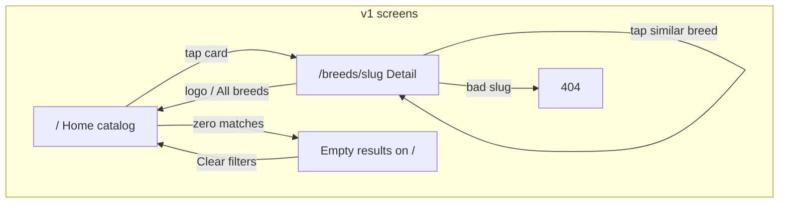
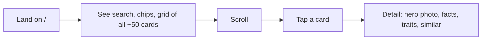
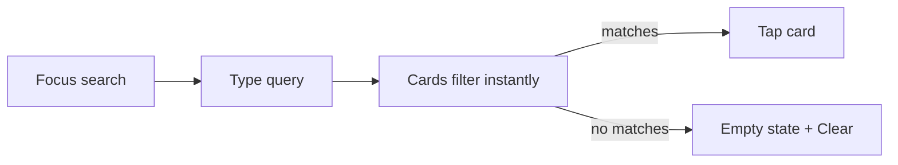
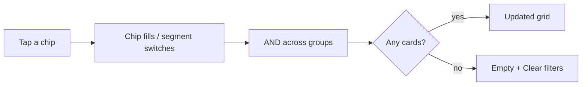
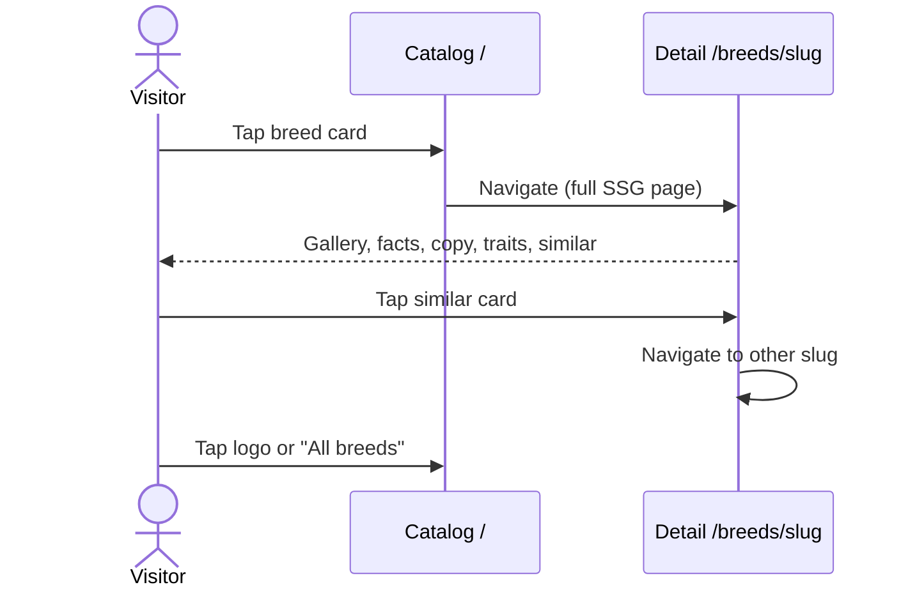
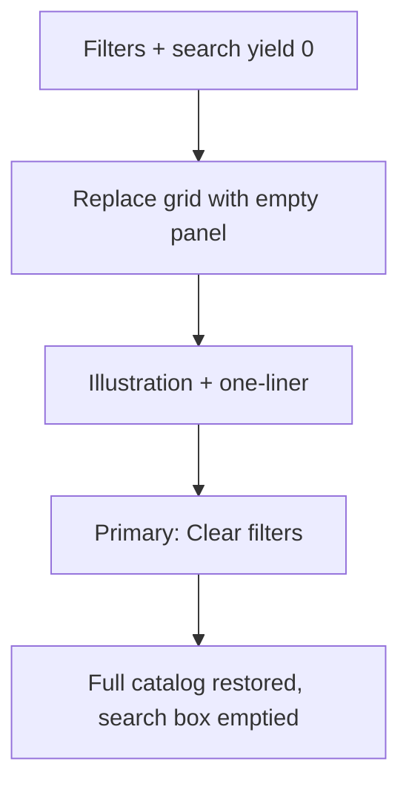
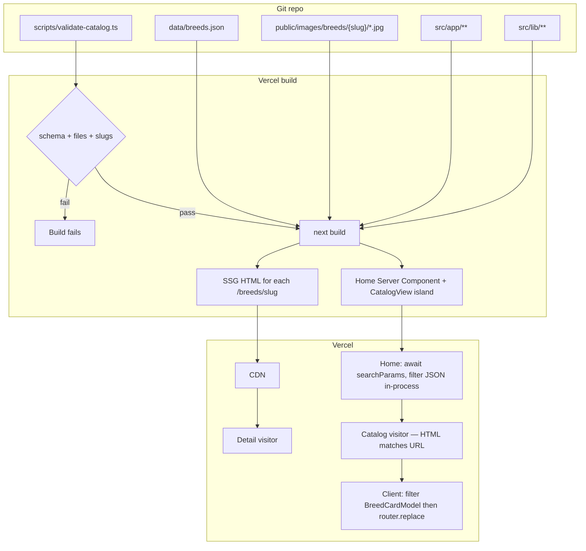

# Cat & Dog Repo — System & Product Design

| Field | Value |
|---|---|
| **Title** | Cat & Dog Repo: Mobile-First Breed Encyclopedia |
| **Author** | Project / Design |
| **Date** | 2026-09-06 |
| **Status** | Draft |
| **Working name** | Cat & Dog Repo (placeholder; see Open Questions) |
| **Workspace** | `/home/pedro/Documents/catapp` |
| **Audience** | Engineering lead and UX / product designer (handoff; neither was in discovery) |
| **Companion pack** | `/home/pedro/Documents/catapp/docs/blueprint/` |

This document is the **canonical** design. The in-repo files under `docs/blueprint/` are a **derived** reading pack (role-split, same decisions). If they disagree, **this file wins until a dated revision of both**. After implementation starts, application code plus this document still win over stale blueprint prose; update the pack in the same revision.

---

## Overview

Cat & Dog Repo is a greenfield public web app: a **mobile-first encyclopedia of cat and dog breeds**. Visitors arrive with a fuzzy question (“what’s a good apartment cat?”, “is a husky a lot of work?”) and leave having **found a breed they understand**. v1 is a curated catalog, not a social network, not an adoption board, and not an AI identifier.

The product is a Next.js (App Router) TypeScript site on Vercel. Breed **detail** pages are fully SSG. Home `/` is a **dynamic Server Component**: it reads `searchParams`, filters the committed JSON, and emits HTML that already matches the URL; a client island then filters a slim `BreedCardModel[]` in memory for later chip taps. The catalog is ~50 breeds (40–60, mixed cats and dogs) in git. There is no login, no CMS UI, and no live third-party breed API as source of truth. Photos live in-repo under `public/images/breeds/` and are served through `next/image`.

Success for v1 is a publicly reachable production app that a casual browser on a phone can search, filter, and open a rich breed page — photos, facts, descriptions, trait scores, similar breeds — in a playful, thumb-friendly UI.

---

## Background & Motivation

People researching a pet typically bounce between Wikipedia (dry, uneven photos, mixed quality), shelter sites (serious, adoption-oriented), and social posts (anecdotal). None of those is a **fast, friendly, comparable** catalog of “what living with this breed is actually like.”

**Current state:** app is **bootstrapped** at `/home/pedro/Documents/catapp` (Next.js App Router). Catalog is **not launched**. Follow the PR Plan; do not treat old implementation notes as design source of truth. No existing users; no brand lock-in beyond the working name.

**Pain points this app is built to remove:**

1. **Comparison is hard.** Traits (shedding, energy, kids, apartment) are scattered or qualitative. We expose them as consistent 1–5 scores and as filters.
2. **Search is brittle.** Breed names have aliases (“GSD”, “German Shepherd”, “Alsatian”). Search must hit name **and** aliases.
3. **Mobile is an afterthought** on encyclopedic sites. This product is designed phone-first: 44px targets, sticky search, wrap-friendly chips, big photos.
4. **User-generated catalogs go stale or spammy.** v1 is admin-curated via pull request to JSON so quality is editorial, not crowdsourced.

v1 is deliberately small: three screens, no accounts, ~50 records. That is enough to ship a real public product and learn whether people actually browse and share breed pages.

---

## Goals & Non-Goals

### Goals (v1)

- Ship a **public production** site on Vercel, indexable, shareable, usable without an account.
- Cover **~50 breeds** (hard range 40–60) spanning popular cats and dogs.
- Let a visitor **search by name/alias** and **filter** by species, size, energy, shedding, good with kids, apartment-friendly.
- Give each breed a **detail page** with gallery (2–5 photos), facts, short + long description, seven trait scores, and similar breeds.
- Feel **playful and mobile-first**: big photos, friendly type, obvious filters, thumb-friendly cards. Desktop is a nicer grid of the same IA, not a different product.
- Be **fast on mid-range phones** (see Performance budgets).
- Be **editable by PR**: adding a breed is a JSON + image commit plus a schema check in CI.

### Non-goals (explicitly out of v1)

- Login, accounts, favorites, comments, ratings, messaging.
- User-submitted breeds, photos, or corrections (beyond “open a GitHub issue/PR”).
- Photo match / AI identify / reverse image search.
- Lost & found, adoption listings, shelters, rescue orgs, breeders directory.
- User pet profiles.
- Admin CMS UI, live TheCatAPI / Dog API as source of truth.
- Maps, geolocation, “breeds near me.”
- Medical diagnosis, “best breed for you” quiz, or scored recommendation engine.
- Native apps, PWA install prompts, offline-first service worker (static pages will still cache via the browser/CDN).
- Internationalization (English only).
- Dark mode (nice-to-have; not a v1 gate).
- Lightbox, 3D, AR, audio, video.

---

## Key Decisions

These are locked for v1. Rationale is included so implementers do not reopen them without a product reason.

| # | Decision | Choice | Rationale |
|---|---|---|---|
| K1 | Job | Breed encyclopedia only | Discovery locked this. Adjacent jobs (adopt, identify, social) inflate scope and change trust/legal posture. |
| K2 | Find yours | Search + filter only | Photo/AI match is a different product (model, dataset, failure UX). Filters on traits solve the v1 job. |
| K3 | Catalog | Fixed, admin-curated | Quality bar, legal photo rights, consistent trait scoring. ~50 rows do not need a CMS. |
| K4 | Catalog size | **50 breeds** target (25 cat / 25 dog), allowed 40–60 | Enough popular coverage to feel real; small enough that client-side search is instant and editorial review is feasible. |
| K5 | v1 filters | Species, size, energy, shedding, good-with-kids, apartment-friendly | Matches the “should I get this for my home?” job. Other traits (grooming, trainability, other pets) show on the detail page but are not v1 filters. |
| K6 | Search | Breed `name` + `aliases`, case/diacritic-insensitive substring | Users type “siamese”, “GSD”, “alsatian”. Fuzzy/typo engines (Fuse with threshold) are unnecessary at n≈50 if we store aliases. |
| K7 | Data source | **In-app JSON** (`data/breeds.json`) as source of truth | Live Cat/Dog APIs have incomplete traits, unstable photos, rate limits, and licensing ambiguity. JSON-in-git is reviewable. |
| K8 | Photos | **Local files** in `public/images/breeds/{slug}/`, not hotlinked | Build-time existence, no broken third-party URLs, consistent crop, Vercel/Next image optimization. Provenance lives **in JSON** (`credit`, `license`, `sourceUrl`, `licenseUrl`) — not only PR descriptions. |
| K9 | Stack | **Next.js (App Router) + TypeScript**, deploy **Vercel**. Pins at PR 1: Next **15.5.25**, React **19.1**, Tailwind **v4**, Node **20.x**, pnpm **9** | Image optimization, `generateStaticParams` for details, preview deploys. Home is request-time server render of local JSON (no DB), not a fully static HTML file per query. |
| K10 | Auth | **None in v1** | Job does not require identity. Removes GDPR/account surface. |
| K11 | CMS | **No CMS UI**; edit catalog by PR to JSON | 50 records; GitHub review is the CMS. |
| K12 | Rendering | **Home:** Server Component reads `searchParams`, filters, renders matching cards; hydrates `CatalogView` with `initialQuery` + slim `BreedCardModel[]`. Subsequent filters are in-memory. URL writer is **only** `router.replace(href, { scroll: false })`. Wrap the island in `<Suspense>`. **Detail:** fully SSG. | Shared `/?species=dog` HTML matches the URL (no full-catalog flash, no hydration mismatch). Chip taps stay instant. Raw `history.replaceState` is forbidden (desyncs the App Router). |
| K13 | Routing | `/` catalog; `/breeds/[slug]` detail | One obvious IA. No `/cats` vs `/dogs` split routes in v1 (species is a filter). |
| K14 | Filter UI | **Chips / pills**, not dropdowns | Visible, thumb-sized, zero extra tap to see options. Dropdowns hide state on mobile. |
| K15 | Filter semantics | Species/size/energy/shedding = single-select groups; kids + apartment = boolean toggles mapped to score ≥ 4 | Simple mental model. Energy/shedding use bands: Low 1–2, Medium 3, High 4–5. |
| K16 | Similar breeds | **Editorial `similarBreedIds`** (2–4, same species) is source of truth; deterministic trait-distance fallback only if a record is missing links | “Similar” is a product judgment (look + lifestyle), not just math. Fallback keeps pages from shipping empty. |
| K17 | Analytics | **Vercel Web Analytics + Speed Insights** (no cookie banner required for first-party, no PII) | Need Web Vitals in production; avoid third-party ad trackers. |
| K18 | Name | Ship as **Cat & Dog Repo** until a rename | Working name is fine for v1 domain/title; rename is copy + metadata, not architecture. |
| K19 | i18n / dark mode | English, light theme only | Scope. Tokens should not hard-block a later dark theme (CSS variables), but no toggle in v1. |
| K20 | Empty state | Dedicated playful empty with **Clear filters** as the primary action | Specified as a v1 screen. Never a blank grid. |
| K21 | CSS | **Tailwind CSS v4** + CSS variables in `globals.css` (no `tailwind.config.ts`) | PR 1 already ships this. Tokens are CSS variables; Tailwind maps them. |
| K22 | Catalog island payload | Pass **`BreedCardModel[]`** (no long descriptions) to `CatalogView`; full `Breed` stays on the server for detail | Keeps the RSC/client payload small; descriptions are unused by search/filter/cards. |
| K23 | Return from detail | Logo/wordmark → `href="/"`. **All breeds** → last catalog URL in `sessionStorage` (`cdr:lastCatalog`) **only if `isSafeCatalogHref`**. Browser Back is native history. | Shareable catalog URLs survive a trip to a breed without clobbering, and logo remains a hard reset. Stored values are allowlisted to `/` plus a query (no open redirects). |
| K24 | Accent / chips | Selected chips: **ink `#1C1917` on `#FADCD6`** plus 2px `#C2410C` border (**13.55:1**). CTA: **white on `#C2410C`** (**5.18:1**). Trait dots: `#C2410C` on cream (**4.74:1**, ≥3:1 non-text). | The original `#FFFFFF` on `#E85D4C` is **3.44:1** and fails AA for 16px chip labels. These ratios are measured; do not “refine” them below AA. |
| K25 | Home JS budget | Home route JS **≤ 150 KB gzip**; detail **≤ 90 KB gzip** (includes Next/React baseline) | A 90 KB home budget does not fit the framework. Measure in PR 5/6; do not ship a second full `Breed[]` to the client. |

---

## Proposed Design

### Product framing

**Primary job:** “Help me understand cat and dog breeds so I can recognize one I might want (or already have).”

**Primary users:**

1. **Curious browser** — tapping around from social or search, high photo sensitivity, low patience.
2. **Pet owner / prospective owner** — comparing 2–3 breeds on shedding, kids, apartment, energy.

Both are anonymous. Neither is asked to create an account. Neither is shopping a shelter inventory.

**Voice:** warm, slightly witty, never mean about a breed, never veterinary advice. Short sentences. Second person is OK on the home page (“Find yours”); third person on breed pages (“The Maine Coon is…”).

**Legal/content posture:** encyclopedia, not a recommendation to acquire a pet. No “best family dog” ranking. Trait scores are editorial estimates of typical breed tendencies, not guarantees of an individual animal.

### Information architecture

Three user-facing screens, plus system pages:

```
Cat & Dog Repo
├── /                          Home / catalog (search + filters + cards)
├── /breeds/[slug]             Breed detail
├── empty catalog results      Same route `/`, empty state UI (not a separate URL)
├── /404                       Playful not-found (unknown slug or unknown path)
├── /sitemap.xml               Generated
└── /robots.txt                Generated
```

No `/about` required for v1 (one-line footer credit is enough). No `/cats` or `/dogs` path — species is a filter so the catalog stays one surface. Deep links to a filtered catalog use query strings, e.g. `/?species=cat&apartment=1`.



### User flows

#### 1. Browse (default)



#### 2. Search by name / alias



Search matches if the normalized query is a substring of normalized `name` or any `aliases[]`. Instant, no submit button (IME: still filter on input; Enter blurs). Debounce **0 ms** at n=50; input is cheap.

#### 3. Filter



#### 4. Open detail + similar



#### 5. Empty results



“Clear filters” clears **query and all chips** back to All / none.

#### 6. Direct / shared link

A shared `https://{host}/breeds/maine-coon` opens the SSG page with full content (SEO). A shared `https://{host}/?species=dog&energy=low` is handled by the **server**: `page.tsx` awaits `searchParams`, runs `filterBreeds`, and emits HTML that already contains only matching cards and selected chips. The client hydrates from those props (`initialQuery`). There is no full-catalog first paint and no hydration mismatch. Playwright must assert this (PR 6).

### Screen inventory

#### Screen 1 — Home / catalog (`/`)

**Purpose:** Get to a breed in under two taps, or refine until the set is small.

**Layout (mobile, 360×640 documented; 360–430px):**

Sticky region is **one contiguous bar** (`position: sticky; top: 0; z-index; cream background`). H1 is **not** between sticky nodes.

```
┌─────────────────────────────┐  STICKY (top: 0)
│  Logo  Cat & Dog Repo       │  56px header — logo/wordmark → clean `/`
│  [🔍 Search breeds         ]│  48px search
│  All  Cats  Dogs            │  44px species segment
├─────────────────────────────┤  /STICKY ≈ 148px
│  Find yours                 │  H1 — scrolls away
│  {sub} 50 cats & dogs…      │  ~56–72px with sub / live count
│  Size · Energy · Shed · …   │  optional chips, wrap ≤ 2 rows, NOT sticky
├─────────────────────────────┤
│  #breed-grid                │  2-col cards, 12px gap
│  ┌─────────┐ ┌─────────┐    │
│  │ photo   │ │ photo   │    │
│  └─────────┘ └─────────┘    │
└─────────────────────────────┘
```

**360×640 remaining viewport (first paint, one chip row):** sticky 148 + H1/sub 72 + chip row 52 ≈ 272px chrome → **~368px** for cards. Two 4:3 card rows in a 2-col grid (card width ~158px → image ~118px + caption) fit. If chips would wrap past two rows, they still wrap (no drawer) but designers must not add a third group in v1.

**Content:**

- Header: wordmark, no nav links in v1 (one primary surface).
- H1: “Find yours” (product language from discovery).
- Sub: “A playful encyclopedia of cat and dog breeds.” When filtering, sub becomes “{n} breeds match” / “1 breed matches”.
- Search placeholder: “Search breeds (try GSD or Siamese)”.
- Cards: photo, name, species, **two tags** (see Breed card anatomy).
- Footer: locked two sentences — “Not veterinary advice. Trait scores are typical for the breed, not a promise about an individual animal. Anonymous usage via Vercel Analytics.” Optional GitHub link after that. No `/privacy` page.

**Interactions:**

- Search and chips update the in-memory grid immediately and write the URL with **`router.replace(pathname + query, { scroll: false })` only** — never `history.replaceState`, never `push`. Back does not undo every chip tap.
- On every query change, `CatalogView` writes `sessionStorage.setItem("cdr:lastCatalog", href)` only after `isSafeCatalogHref(href)` (guard `typeof window !== "undefined"`). This is not a saved search; it only powers the detail-page **All breeds** link.
- Species “All” is the zero-state of that group (no `species` query param).
- Tapping an already-selected size/energy/shedding chip **deselects** it (return to any).
- Toggle chips (kids, apartment) tap on/off.
- Card is one hit target (the whole card, not separate text links).

**Loading:** First paint is **server HTML for that URL** (all cards on `/`, filtered cards on `/?species=cat`, empty panel on zero matches). No skeleton, no full-catalog flash. Images lazy-load except the first two visible cards (`priority`). Cream placeholder (`blur` or solid `#FBF4EA`). `CatalogView` is wrapped in `<Suspense fallback={the same server-rendered grid}>`.

**Error:** If JSON is malformed the **build fails** (see schema validation). Runtime catalog has no fetch to fail. Images that 404 show the placeholder block + alt text; they should not 404 because CI checks files exist.

**Sticky behavior (mobile):** One contiguous sticky stack: **AppHeader + Search + SpeciesSegment**. H1/sub and optional chips scroll away. On `md+`, nothing sticks; order is Header → H1/sub → Search → all chips → grid.

#### Screen 2 — Breed detail (`/breeds/[slug]`)

**Purpose:** Answer “what is this breed like to live with?” and offer a next breed.

**Layout (mobile):**

```
┌─────────────────────────────┐
│  ← All breeds    wordmark   │
├─────────────────────────────┤
│  [        hero photo      ] │  4:3, full bleed in content column
│  ○ ○ ○ ○                    │  Gallery dots / thumb strip
├─────────────────────────────┤
│  CAT                        │  Species eyebrow
│  Maine Coon                 │  H1
│  aliases: Coon Cat, …       │  If any
├─────────────────────────────┤
│  Origin  Size  Coat  Life   │  Fact row, 2×2 on mobile
├─────────────────────────────┤
│  Short description          │  Lead paragraph (from shortDescription)
│  Longer description         │  2–3 more paragraphs
├─────────────────────────────┤
│  How they live              │  Section title
│  Energy        ●●●●○        │  All 7 traits
│  …                          │
├─────────────────────────────┤
│  If you like this           │  Similar module
│  [card] [card] [card]       │  Horizontal snap, then wrap on desktop
└─────────────────────────────┘
```

**Must include (locked):** photos, facts, descriptions, trait scores, related/similar breeds.

**Interactions:**

- **Logo / wordmark** (header right): always `href="/"` — hard reset, no query.
- **All breeds** (header left): server-render `href="/"`. After mount, read `sessionStorage["cdr:lastCatalog"]` and set `href` **only if** `isSafeCatalogHref(value)` (see Routing). Otherwise `/`. Not a v2 saved search.
- **Browser Back:** native history. Because chip taps `replace` rather than `push`, Back from a detail page returns to the filtered catalog URL the user left.
- Gallery: horizontal swipe, snap-to-slide, dots; tap does **not** open a lightbox in v1.
- Similar cards navigate to that slug (full page).
- Trait meters are not interactive (not filters).

**Loading:** SSG, so content is in HTML. Hero image `priority`.

**Unknown slug:** `not-found.tsx` — playful 404, CTA “Browse all breeds”.

#### Screen 3 — Empty / no results

Not a unique route. When `filtered.length === 0`:

- Hide the grid.
- Show a large illustration (simple line-drawn cat and dog looking under a rug, or similar — designer executes).
- Headline: “No pals in this mix.”
- Body: “Nothing matches those filters. Try fewer chips, or clear them and start over.”
- Primary button: **Clear filters** (white label on `#C2410C`, **5.18:1**, 48px height, full width on mobile). After click, move focus to the search field (`#breed-search`).
- Empty panel **keeps** `id="breed-grid"` (skip link still works). Illustration: original SVG preferred; a geometric placeholder SVG is allowed if the illustration is late (PR 6 must not block on art).
- Do not show “0 results” as a blank page. Do not show a sad shelter photo.

**404** (wrong path): “This breed ran off.” + Browse CTA. Different copy from filter-empty so users know it is a bad URL, not a filter miss.

### Search & filter UX (locked)

**Pattern: chips / pills + one search field. No dropdowns, no off-canvas filter sheet, no modal.**

At 50 items, every filter option can be on-screen. Dropdowns add a tap and hide selected state. A bottom sheet is extra chrome.

**Mobile behavior:**

- Search is 48px, 16px type (no iOS zoom), type `search`, `inputmode="search"`, `autocomplete="off"`.
- Chip height **44px** (WCAG 2.2 target size; meets 2.5.5 AAA 44px and exceeds 2.5.8 AA 24px). Horizontal padding 14px, corner radius 999px, 8px gap, **wrap** (no horizontal scroll region).
- Species is a 3-segment control (All | Cats | Dogs), height 44px, visually distinct from the optional chips so “All” is obviously the default.
- Active chips: fill `--color-accent-soft` (`#FADCD6`), **ink** label (`#1C1917`, **13.55:1**), 2px `--color-accent` border, `aria-pressed="true"`. Unselected: cream fill, sand outline, ink label. One accent for all species (no rainbow). Never white text on `#E85D4C`.
- Live result count is the status text; also an `aria-live="polite"` region: “12 breeds”.

**AND logic** across groups. Within size / energy / shedding, at most one chip. Species at most one (or All).

**URL scheme** (canonical query keys):

| Key | Values | Default (omitted) |
|---|---|---|
| `q` | string | none |
| `species` | `cat` \| `dog` | all |
| `size` | `small` \| `medium` \| `large` | all |
| `energy` | `low` \| `medium` \| `high` | all |
| `shedding` | `low` \| `medium` \| `high` | all |
| `kids` | `1` | off |
| `apartment` | `1` | off |

Example: `/?q=shepherd&species=dog&energy=high&kids=1`

Unknown query keys ignored. Invalid values ignored (do not 404 the home page).

### Breed card anatomy

Each card is a single `<a href="/breeds/{slug}">`.

```
┌──────────────────────┐
│                      │  Photo 4:3, object-fit cover, 12px top radius
│       photo          │  Species pill overlay top-left: CAT / DOG
│                      │
├──────────────────────┤
│ Maine Coon           │  Name, 1 line, truncate
│ Large · Low shed     │  Exactly two tags (see rule)
└──────────────────────┘
```

**Two-tag rule (deterministic, so cards feel consistent):**

1. Tag A = `sizeClass` labeled Small / Medium / Large.
2. Tag B = the more “useful surprise”:
   - If `apartmentFriendly >= 4` → “Apartment OK”
   - Else if `goodWithKids >= 4` → “Good with kids”
   - Else if `shedding <= 2` → “Low shed”
   - Else if `energy >= 4` → “High energy”
   - Else → coat label (“Long coat”, “Hairless”, …)

This is display-only; it does not change filter logic. Implement in `src/lib/tags.ts` as `cardTags(breed): [string, string]`.

Photo alt: `"{name} {species}"` (e.g. “Maine Coon cat”). Do not use “image of”.

### Trait score visualization

All seven traits on the detail page, always in this order:

1. Energy
2. Shedding
3. Trainability
4. Good with kids
5. Good with other pets
6. Apartment-friendly
7. Grooming need

**Visual:** a row = label (left) + five-dot meter (right) + visually hidden numeric text for AT: “Energy, 4 out of 5”.

- Filled dots: `--color-accent` (`#C2410C`, **4.74:1** on cream — UI component contrast).
- Empty dots: sand outline.
- Shape: circles, 10–12px, 6px gap — **not** paw icons in v1 (paws at 10px fail contrast/recognition). Optional paw motif can live in the logo, not the meter.
- Not a slider. Not a bar chart. Not emoji.

**Copy next to extreme scores is not required in v1**; the section intro line is enough: “Typical for the breed — individuals vary.”

### Similar / related module

**UX copy:** section heading **“If you like this”**. Sub: “Close in lifestyle and looks, not a ranking.”

Do **not** say “recommended for you” (implies personalization we do not have). Do **not** say “related articles”.

Show 2–4 cards (same `BreedCard` component, compact). Horizontal snap carousel on mobile; 3-up grid on desktop.

**What “similar” means (product):** editorially chosen breeds of the **same species** a visitor might consider in the same household context — similar size/energy/coat vibe, not “also a mammal”. See algorithm in Engineering / Content model.

### Visual direction

**Principles:**

1. **Photos first.** Type and chrome get out of the way.
2. **Playful, not childish.** No comic-sans, no paw-print wallpaper, no “so fun!!!” copy.
3. **Not shelter-serious.** No guilt, no urgent banners, no muted institutional blue-grey.
4. **Not Wikipedia-dry.** Generous crop, short paragraphs, obvious filters.
5. **One accent.** Coral on cream. Sage as a quiet secondary (species badge for cats). Navy-teal for dogs. Ink for text.

**Palette (locked for PR 2 — designer may refine hues that still meet the measured ratios; do not ship a pair below AA):**

| Token | Hex | Contrast (measured) | Use |
|---|---|---|---|
| `--color-bg` | `#FBF4EA` | — | Page cream |
| `--color-surface` | `#FFFFFF` | — | Cards |
| `--color-ink` | `#1C1917` | **16.01:1** on cream | Body text, chip labels |
| `--color-ink-muted` | `#57534E` | **6.99:1** on cream | Secondary 16px |
| `--color-accent` | `#C2410C` | **5.18:1** with white; **4.74:1** on cream | CTA fill, chip border, filled trait dots |
| `--color-accent-hover` | `#9A3412` | **7.31:1** with white | CTA press |
| `--color-accent-soft` | `#FADCD6` | **13.55:1** with ink | Selected chip fill |
| `--color-accent-deco` | `#E85D4C` | 3.44:1 with white — **not for text** | Logo mark only, ≥48px, no labels |
| `--color-cat` | `#3D6B5A` | badge: white text — verify ≥4.5:1 or use ink | Cat species badge |
| `--color-dog` | `#3F6F8A` | same rule | Dog species badge |
| `--color-sand` | `#E8D9C4` | — | Hairlines, empty dots |
| `--color-focus` | `#1C1917` | — | 2px ring + 2px cream offset |

Selected chip = ink on accent-soft + accent border (color **and** shape **and** `aria-pressed`). CTA = white on `#C2410C`. Do not use white-on-`#E85D4C` for 16px UI.

**Type:**

- Display / H1: **Fraunces** (soft serif), weight 600, slightly italic allowed on the home H1 only.
- UI / body: **Nunito** (rounded sans), 400/600/700.
- Body size 16px / 1.5. Card title 16px/700. Detail H1 32px mobile / 44px desktop.
- Load via `next/font/google`. `display: swap`. Subset latin.

**Spacing:** 8px grid. Page padding 16px mobile, 24px tablet, 32px desktop. Card radius 16px. Max content width 1120px.

**Motion:** 150–200ms `ease-out` on chip fill and card press (`scale(0.98)`). Gallery swipe is native scroll-snap, not JS animation. **`prefers-reduced-motion: reduce`** disables scale and any transform; color change remains.

**Imagery:** natural photos, animal in focus, uncluttered background preferred. No stock-photo watermarks. No sad crate photos. Consistent 4:3 for cards and gallery slides.

### Component inventory

| Component | Path | Notes |
|---|---|---|
| `AppHeader` | `src/components/AppHeader.tsx` | Logo + wordmark (`/`); detail: All breeds + wordmark |
| `AppFooter` | `src/components/AppFooter.tsx` | Vet disclaimer + “Anonymous usage via Vercel Analytics” |
| `SearchInput` | `src/components/SearchInput.tsx` | Controlled, accessible label |
| `FilterBar` | `src/components/FilterBar.tsx` | Species segment + chip groups |
| `FilterChip` | `src/components/FilterChip.tsx` | Selected/unselected, `aria-pressed` |
| `SpeciesSegment` | `src/components/SpeciesSegment.tsx` | All / Cats / Dogs radiogroup |
| `BreedGrid` | `src/components/BreedGrid.tsx` | Responsive grid |
| `BreedCard` | `src/components/BreedCard.tsx` | Photo, name, species, 2 tags |
| `EmptyResults` | `src/components/EmptyResults.tsx` | Illustration + Clear |
| `ClearFiltersButton` | `src/components/ClearFiltersButton.tsx` | Used in empty + optionally in bar when dirty |
| `CatalogView` | `src/components/CatalogView.tsx` | Client island: URL + search + filter + grid |
| `ResultCount` | `src/components/ResultCount.tsx` | `aria-live` |
| `PhotoGallery` | `src/components/PhotoGallery.tsx` | Snap carousel + dots |
| `FactList` | `src/components/FactList.tsx` | Origin, size, coat, lifespan |
| `TraitMeter` | `src/components/TraitMeter.tsx` | One 1–5 meter |
| `TraitList` | `src/components/TraitList.tsx` | Seven meters |
| `SimilarBreeds` | `src/components/SimilarBreeds.tsx` | Section + cards |
| `SpeciesBadge` | `src/components/SpeciesBadge.tsx` | CAT / DOG |
| `TagChip` | `src/components/TagChip.tsx` | Read-only card tags |

App Router files: `src/app/layout.tsx`, `src/app/page.tsx`, `src/app/breeds/[slug]/page.tsx`, `src/app/not-found.tsx`, `src/app/sitemap.ts`, `src/app/robots.ts`, `src/app/opengraph-image.tsx` (site-wide OG for `/` only). **No** per-breed `opengraph-image.tsx` — detail OG is the hero JPEG via `generateMetadata`.

### Responsive behavior

Mobile-first breakpoints (CSS, not a second IA):

| Name | Width | Grid | Notes |
|---|---|---|---|
| base | 0–639px | 2 cards | Contiguous sticky: header+search+species; H1 scrolls |
| `sm` | 640px+ | 2 cards, more padding | |
| `md` | 768px+ | 3 cards | Filters all visible in one band, not sticky |
| `lg` | 1024px+ | 4 cards | Detail: gallery 2-col thumbs under hero optional; facts in one row |
| `xl` | 1280px+ | 4 cards, max-width 1120px centered | |

Never more than 4 columns — cards go too small and photos lose the “big photo” principle.

Detail: single column until `md`, then optional two-column (gallery left 50% / text right) is **allowed** but not required; a stacked layout with a wider hero is acceptable if it keeps photos big.

### Accessibility

- WCAG 2.2 AA target.
- Hit targets **≥ 44×44px** for every control, including chips (height locked at 44px). This meets 2.5.5 and exceeds 2.5.8 (24px).
- Focus visible on all interactive elements (`:focus-visible` ring).
- Search: `id="breed-search"`, visible label or `aria-label="Search breeds"`.
- Species segment is `role="radiogroup"`; chips that toggle use `aria-pressed`.
- Result count `id="catalog-status"` `aria-live="polite"`.
- Images always have alt; decorative empty-state illustration `alt=""`.
- Trait meters: not the only channel; include visually hidden “{n} out of 5”.
- Color is not the only selected-chip cue (soft fill **and** accent border **and** `aria-pressed="true"`).
- Skip link “Skip to breeds” to `#breed-grid`. The empty panel **is** `#breed-grid` when the card list is hidden.
- After **Clear filters**, move focus to `#breed-search`.
- Keyboard: tab through chips and cards; Enter/Space on chips.
- Reduced motion honored.
- `html lang="en"`.
- Do not trap scroll in the gallery (it is overflow-x on the strip, still swipeable, tabbable dots or images).
- Contrast: see palette table (measured). Muted ink `#57534E` on `#FBF4EA` is **6.99:1**.

### Content guidelines (breed copy)

- **shortDescription:** 140–220 characters, one or two sentences. What you’d say at a party. No trait laundry lists (those are scored below).
- **description:** 180–350 words, typically three short paragraphs: (1) personality and history hook, (2) living with them (energy, shed, space), (3) notable facts / origin color. No medical protocols. No “great first pet” claims unless we are willing to stand behind them — prefer “often chosen as…”.
- **Tone:** affectionate, specific, concrete (“needs a daily walk”, not “somewhat active”). Wit allowed once per breed, not forced.
- **Forbidden:** body-shaming mixed breeds, aggression stereotyping as destiny, “hypoallergenic guarantee”, price lists, breeder links in v1.
- **Aliases:** common nicknames and abbreviations only, not every misspelling.
- **Health:** one factual sentence in the long description is OK (e.g. brachycephalic breathing). Not a veterinary monograph.

### Architecture (engineering)



**Request path:** no database, no session store, no user PII. Detail URLs are prebuilt files. Home `/` runs a Server Component per request (or per unique `searchParams` cache): import JSON, `parseCatalogQuery`, `filterBreeds`, render cards. CPU is trivial at n=50.

**Hydration contract (locked):**

1. `page.tsx` (Server Component) awaits `searchParams`, builds `initialQuery` and `cards: BreedCardModel[]` (**all** cards, slim).
2. It also computes `visible = filterBreeds(cards, initialQuery)` and renders that list (or `EmptyResults`) in the **same** component tree `CatalogView` will use.
3. `CatalogView` is a client component whose **first render** uses `initialQuery` / the server-visible list as props — it does **not** read `window.location` or `useSearchParams()` to decide the first paint.
4. After hydrate, chip/search updates filter `cards` in memory and call `router.replace` only.
5. `<Suspense>` wraps the island; fallback is the server-rendered grid (identical).

JS-disabled: user sees the server HTML for that URL (all or filtered). Chips do not work. `<noscript>`: “Filters need JavaScript. Every breed matching this link is listed below.”

**Data load:** `src/lib/catalog.ts` imports `data/breeds.json` (CI + `prebuild` validate):

- `getAllBreeds(): Breed[]`
- `getBreedBySlug(slug: string): Breed | undefined`
- `getBreedById(id: string): Breed | undefined`
- `toCardModel(breed: Breed): BreedCardModel`
- `getCardModels(): BreedCardModel[]`
- `filterBreeds(records: CatalogRecord[], query: CatalogQuery): CatalogRecord[]` — applies search + filters, returns **locale-sorted** by `name` (`en`, `sensitivity: "base"`)
- `resolveSimilar(breed, all): Breed[]`

`matchesQuery` lives in `search.ts` and is not a public `catalog.ts` export. No REST API. No Route Handlers.

### Proposed repository file tree

```
/home/pedro/Documents/catapp/
├── docs/
│   └── blueprint/                  # derived pack; canonical doc wins on conflict
│       ├── README.md
│       ├── PRODUCT.md
│       ├── UX.md
│       ├── ENGINEERING.md
│       ├── CONTENT-MODEL.md
│       ├── PR-PLAN.md
│       └── HANDOFF-ENG.md          # thin pointer to PR-PLAN, not a second plan
├── data/
│   └── breeds.json                 # source of truth + photo provenance ledger
├── public/
│   ├── favicon.ico
│   ├── icon.svg
│   ├── apple-touch-icon.png
│   └── images/
│       ├── empty-no-results.svg
│       └── breeds/
│           ├── maine-coon/
│           │   ├── 01.jpg          # hero
│           │   ├── 02.jpg
│           │   └── 03.jpg
│           └── …/{01..05}.jpg
├── scripts/
│   └── validate-catalog.ts         # schema, unique slugs, image existence, similar ids
├── src/
│   ├── app/
│   │   ├── globals.css
│   │   ├── layout.tsx
│   │   ├── page.tsx                # catalog
│   │   ├── not-found.tsx
│   │   ├── sitemap.ts
│   │   ├── robots.ts
│   │   ├── opengraph-image.tsx     # site-wide OG for `/` only
│   │   └── breeds/
│   │       └── [slug]/
│   │           └── page.tsx        # generateMetadata.images = hero JPEG
│   ├── components/                 # see inventory
│   ├── lib/
│   │   ├── catalog.ts
│   │   ├── search.ts               # matchesQuery; not re-exported as searchBreeds
│   │   ├── filters.ts
│   │   ├── similar.ts
│   │   ├── tags.ts
│   │   ├── slug.ts                 # toSlug() + assert id === species-slug; validator only
│   │   ├── seo.ts
│   │   └── query.ts                # CatalogQuery, parse/serialize, isSafeCatalogHref
│   ├── types/
│   │   └── breed.ts
│   └── fonts (via next/font, no folder required)
├── tests/
│   ├── unit/
│   │   ├── search.test.ts
│   │   ├── filters.test.ts
│   │   ├── similar.test.ts
│   │   ├── tags.test.ts
│   │   └── query.test.ts
│   └── e2e/
│       ├── catalog.spec.ts
│       ├── filters.spec.ts
│       ├── empty.spec.ts
│       └── detail.spec.ts
├── .github/
│   └── workflows/
│       └── ci.yml
├── next.config.ts
├── tsconfig.json
├── package.json
├── eslint.config.mjs
├── playwright.config.ts
├── vitest.config.ts
└── README.md                       # run/dev/deploy (app readme, not the blueprint)
```

### Search algorithm

File: `src/lib/search.ts`.

```ts
function normalize(s: string): string {
  return s
    .normalize("NFD")
    .replace(/\p{M}/gu, "")
    .toLowerCase()
    .trim()
    .replace(/\s+/g, " ");
}

export function matchesQuery(breed: CatalogRecord, q: string): boolean {
  const nq = normalize(q);
  if (!nq) return true;
  const haystacks = [breed.name, ...breed.aliases];
  return haystacks.some((h) => normalize(h).includes(nq));
}
```

- Substring, not token AND. “german shep” matches “German Shepherd”.
- No stemming. No Levenshtein. Add an alias instead of fuzzy-matching typos (“siamees” will miss unless we add it — acceptable at v1).
- Empty query matches all.
- Search is applied **after** loading the full array, **before** or **after** structural filters — order does not matter because both are predicates ANDed in `filterBreeds`.

### Filter algorithm

`CatalogQuery` and `EnergyBand` live **once** in `src/lib/query.ts` (import them; do not redeclare in `filters.ts`).

File: `src/lib/query.ts` (href allowlist + query type):

```ts
export type EnergyBand = "low" | "medium" | "high";

export type CatalogQuery = {
  q?: string;
  species?: "cat" | "dog";
  size?: "small" | "medium" | "large";
  energy?: EnergyBand;
  shedding?: EnergyBand;
  kids?: boolean;
  apartment?: boolean;
};

/** Allow only `/` or `/?…` with a conservative query charset. Reject `//`, `/\`, whitespace. */
const CATALOG_HREF = /^\/(?:\?[A-Za-z0-9._~=&%-]+)?$/;

export function isSafeCatalogHref(value: string): boolean {
  if (!CATALOG_HREF.test(value)) return false;
  try {
    const u = new URL(value, "https://example.invalid");
    return u.pathname === "/" && u.username === "" && !value.startsWith("//");
  } catch {
    return false;
  }
}
```

File: `src/lib/filters.ts`.

```ts
import type { CatalogQuery, EnergyBand } from "./query";
import type { CatalogRecord } from "@/types/breed";

export function scoreToBand(score: 1 | 2 | 3 | 4 | 5): EnergyBand {
  if (score <= 2) return "low";
  if (score === 3) return "medium";
  return "high";
}

export function matchesFilters(breed: CatalogRecord, query: CatalogQuery): boolean {
  if (query.species && breed.species !== query.species) return false;
  if (query.size && breed.sizeClass !== query.size) return false;
  if (query.energy && scoreToBand(breed.traits.energy) !== query.energy) return false;
  if (query.shedding && scoreToBand(breed.traits.shedding) !== query.shedding) return false;
  if (query.kids && breed.traits.goodWithKids < 4) return false;
  if (query.apartment && breed.traits.apartmentFriendly < 4) return false;
  return true;
}

export function filterBreeds<T extends CatalogRecord>(
  breeds: T[],
  query: CatalogQuery,
): T[] {
  return breeds
    .filter((b) => matchesQuery(b, query.q ?? "") && matchesFilters(b, query))
    .sort((a, b) => a.name.localeCompare(b.name, "en", { sensitivity: "base" }));
}
```

`CatalogQuery` is imported from `src/lib/query.ts` — do not redeclare it in `filters.ts`. `filterBreeds` **returns locale-sorted results** (do not sort again in the UI). Do not sort by “relevance”. Do not pin featured breeds. `matchesQuery` / `matchesFilters` accept `CatalogRecord`, so they work on `Breed` and `BreedCardModel`.

**Kids / apartment:** score ≥ 4 means “yes” for the chip. Scores 1–3 are excluded when the chip is on. There is no “not good with kids” chip.

### Similar-breeds algorithm

File: `src/lib/similar.ts`.

**Primary (ship this):**

1. Read `breed.similarBreedIds` (length 2–4).
2. Map each id through `getBreedById`. Drop missing (should be impossible after CI).
3. Drop self and drop other species (CI should already forbid).
4. Preserve editorial order.
5. Return those breed objects.

**Fallback (deterministic, for safety if a record has `< 2` valid ids):**

Let \( t(b) \) be the 7-tuple of trait scores in the canonical order (energy, shedding, trainability, goodWithKids, goodWithOtherPets, apartmentFriendly, groomingNeed).

Distance: Manhattan \( d(a,b) = \sum_i |t(a)_i - t(b)_i| \).

Candidates: same `species`, `id !== self`.

Sort by `(distance ASC, name ASC)`. Take enough to fill **3** total (editorial hits first, then fallback). If still short (should not happen with 25/species), show what we have.

**Do not** mix cats and dogs in similar. **Do not** randomize (SSR/client mismatch, non-reviewable).

**Build-time validation** (`scripts/validate-catalog.ts`):

- Every `similarBreedIds` entry exists, is not self, is same species.
- Warn (CI warning, not fail) if the graph is not symmetric.
- Fail if any breed has 0 valid similar ids after resolution — editors must fill them.

### Routing

| Route | Type | Source |
|---|---|---|
| `/` | **Dynamic Server Component** (`searchParams`) | `src/app/page.tsx` — parse query, pass `initialQuery` + `BreedCardModel[]` into `CatalogView` inside `<Suspense>` |
| `/breeds/[slug]` | SSG | `generateStaticParams` from all slugs; `generateMetadata` per breed (OG = hero JPEG) |
| unknown slug | 404 | `notFound()` |
| `/sitemap.xml` | generated | `/` + each `/breeds/{slug}` (query variants are **not** sitemap entries) |
| `/robots.txt` | generated | allow `/`, sitemap URL |

`trailingSlash: false`. Slugs: ASCII kebab, globally unique. Collision policy: suffix species (`burmese-cat`).

Client navigation via Next `<Link>`. Catalog filter state lives in the query string of `/`. Detail **All breeds** may additionally read `sessionStorage["cdr:lastCatalog"]` **iff** `isSafeCatalogHref` (K23). Logo is always `/`. Never assign a raw stored string to `href`.

Do not add `/privacy`. Footer discloses analytics (see Security).

### Image strategy

**Pick: locally stored files, statically referenced.**

- Path convention: `public/images/breeds/{slug}/{nn}.jpg` where `nn` is `01`–`05`. `01` is always the hero (card + OG + first gallery slide).
- JSON `photos[].src` is the public URL path, e.g. `/images/breeds/maine-coon/01.jpg`.
- `width` and `height` required (intrinsic pixels) to lock aspect and avoid CLS.
- `alt` required, unique per photo (pose/context), not just the breed name on every slide.
- `credit`, `license`, and `sourceUrl` required on every photo. `licenseUrl` required unless `license` is `CC0` or `public-domain`. `licensed` is allowed **only** when both URLs are present.
- Gallery caption format:
  - `CC0` / `public-domain`: `{credit}. Public domain.` (`credit` links to `sourceUrl` if present)
  - `CC BY` / `CC BY-SA`: `{credit} ({license})` — name links to `sourceUrl`, license name links to `licenseUrl`
  - `licensed`: `{credit}. Used under license.` — name → `sourceUrl`, “license” → `licenseUrl`
- The catalog JSON **is** the durable rights ledger. PR descriptions are not. Launch is blocked on attribution completeness (every photo has the required URLs), not only file existence.
- `next/image`: `sizes` for cards `(max-width: 640px) 50vw, (max-width: 1024px) 33vw, 25vw`; hero `(max-width: 768px) 100vw, 800px`.
- Formats: author JPEGs in repo; Vercel Image Optimization serves AVIF/WebP derivatives. Do not commit four formats per photo.
- Max source dimension: 1600px on the long edge, quality ~80, typically 150–300 KB each. Budget: 50 breeds × 3 photos × 250 KB ≈ **37.5 MB** git LFS not required at that size; keep sources compressed.
- **Forbidden:** hotlinking TheCatAPI/Dog API/Unsplash random URLs as production src. Fine to *obtain* images from licensed sources and **commit** them.
- CI: every `photos[].src` exists on disk; 2–5 photos per breed; `01` present.

### SEO

- Title template: `%s · Cat & Dog Repo`. Home: `Find your cat or dog breed · Cat & Dog Repo`. Detail: `{Name} ({Cat|Dog}) · Cat & Dog Repo`.
- **Home meta description (locked, 137 chars):** `Find yours among cat and dog breeds. Search by name, filter for shedding, energy, kids, and apartments, and open a photo-rich breed page.`
- Detail meta: `shortDescription` truncated to 160.
- Canonical URL per **path** (`metadataBase` from `NEXT_PUBLIC_SITE_URL`). Query strings are not canonicals.
- **Open Graph (locked):**
  - `/`: `src/app/opengraph-image.tsx` (ImageResponse, 1200×630, wordmark on cream — no photo required).
  - `/breeds/[slug]`: `generateMetadata` → `images: [{ url: breed.photos[0].src, width, height, alt }]` (the committed hero JPEG). **Do not** add `breeds/[slug]/opengraph-image.tsx`.
- Twitter card: `summary_large_image`.
- Semantic HTML: one `h1` per page, `article` on detail, list of cards, `nav` for header, facts in `<dl>`.
- JSON-LD on detail: Schema.org **`Thing`** only (`name`, `image`, `description`, `additionalType` species) via `breedJsonLd(breed)` in `src/lib/seo.ts`.
- `sitemap.ts`: `/` priority 1.0, each breed 0.8, `monthly`. Query variants omitted.
- `robots.ts`: allow all.
- Unique copy per breed (editorial). Do not generate spam pages.

### Performance budgets (mobile)

Measured on a mid-range Android profile (Moto G / Slow 4G) in Lighthouse CI or Vercel Speed Insights. **Budgets are gates for v1 launch**, not aspirations.

| Metric | Budget |
|---|---|
| LCP (home, detail) | ≤ 2.5s |
| CLS | ≤ 0.05 (stricter than 0.1 because we know image dimensions) |
| INP | ≤ 200ms |
| JS, home (gzip, route, **includes Next/React**) | ≤ 150 KB |
| JS, detail (gzip, includes framework) | ≤ 90 KB |
| Fonts | 2 families, latin subset, ≤ 40 KB each |
| Card image decoded size | 4:3 at ~400px wide |
| Hero | ≤ 1200px wide delivered |
| Time to interactive filter | ≤ 100ms after JS for 50 items (cheap) |

Tactics: SSG details, server-filtered home, `next/image`, `priority` only on first-row **visible** cards + detail hero, no client fetch, no date-fns, no UI kit, **Tailwind CSS v4** + CSS variables (K21). Pass **`BreedCardModel[]` once** from the server into `CatalogView` (K22). Never serialize `description` to the island.

Measure the PR 1 stub and PR 5 home against the 150/90 KB budgets; if the framework baseline alone exceeds them on a given Next patch, raise the budget in the same PR that records the measurement — do not silently drop Analytics to “make the number.”

### Testing strategy

| Layer | Tool | What |
|---|---|---|
| Catalog integrity | `scripts/validate-catalog.ts` in CI and `prebuild` | Schema (Zod), unique id/slug, 2–5 photos exist, similar ids, trait range 1–5, 40–60 breeds, mix of both species |
| Unit | Vitest | `search`, `filters`, `similar`, `tags`, `query` parse/serialize — table-driven |
| Component | Vitest + Testing Library | `FilterBar` keyboard/`aria-pressed`; `EmptyResults` clear; `TraitMeter` accessible name |
| E2E | Playwright (CI from PR 6) | (1) home shows cards, (2) search “siamese” narrows, (3) species=cat, (4) combo filter to empty + clear restores + **focus moves to search**, (5) open detail, (6) similar navigates, (7) 404 slug, (8) **full load of `/?species=cat` has only cat cards in the first HTML and does not throw a hydration error**, (9) All breeds after a filtered session returns to the stored query |
| A11y | Playwright + axe-core on `/` and one detail | No serious/critical |
| Visual | optional later; not a v1 gate | |
| Types | `tsc --noEmit` | CI |

Seed a **fixture catalog** of 6 breeds in `tests/fixtures/breeds.json` covering both species, alias search, kids/apartment edges, similar graph — unit tests do not depend on the full 50.

### Deployment

- Host: **Vercel**, Git integration on `main`.
- Framework preset: Next.js. Details: SSG via `generateStaticParams`. Home: dynamic Server Component (no `output: "export"` — we need `searchParams` and `next/image`).
- Env: `NEXT_PUBLIC_SITE_URL` (production domain). Preview deployments get the Vercel preview URL as metadataBase fallback.
- **Pins (PR 1, recorded in `package.json`):** Node **20.x**, Next.js **15.5.25**, React **19.1.0**, Tailwind **v4**, pnpm **9.15.9**. Bump only in a dedicated chore PR.
- Build: `pnpm` (lockfile committed). Scripts: `dev`, `build`, `start`, `lint`, `test`, `test:e2e`, `validate`.
- Preview URLs for every PR.
- Production domain: whatever the owner attaches; document in app `README.md` at deploy time. No www-vs-apex fork in this design — pick apex + redirect www in Vercel project settings.
- Rollback: Vercel instant rollback to previous deployment.
- **No** edge middleware in v1.

### Risks (severity → mitigation)

| Risk | Sev | Mitigation |
|---|---|---|
| Photo licensing / takedown | High | Required `sourceUrl` + `licenseUrl` (unless CC0/public-domain) on every photo in `data/breeds.json` (the ledger). Validator fails incomplete attribution. Replace files in a PR. Launch blocked on attribution, not only bytes on disk. |
| Trait scores argued as fact | Med | Copy: “Typical for the breed — individuals vary.” Not a quiz, not medical. |
| Empty-feeling catalog if <40 | Med | Do not launch below 40. PR plan puts a content complete PR before public launch. |
| Name collision / rename | Low | Wordmark in one component; title template in `layout.tsx`. |
| Client JS required for subsequent filters | Low | First paint is server HTML for that URL. `<noscript>`: “Filters need JavaScript. Every breed matching this link is listed below.” |
| Home JS budget vs framework | Med | Budget is 150 KB gzip including Next/React. Slim `BreedCardModel`. Measure in PR 5/6. |
| Similar-breed subjectivity | Low | Editorial list + documented fallback; reviewers check in the content PR. |
| Scope creep (favorites, AI) | High | Non-goals list; PRs that add those are rejected for v1. |
| CLS from fonts/images | Med | `next/font`, width/height on images, cream placeholder. |

---

## API / Interface Changes

There is **no public HTTP API** in v1.

**Internal TypeScript interfaces** (canonical; also in `src/types/breed.ts`):

```ts
export type Species = "cat" | "dog";
export type SizeClass = "small" | "medium" | "large";
export type CoatType =
  | "short"
  | "medium"
  | "long"
  | "hairless"
  | "double"
  | "curly";
export type TraitScore = 1 | 2 | 3 | 4 | 5;

export interface BreedTraits {
  energy: TraitScore;
  shedding: TraitScore;
  trainability: TraitScore;
  goodWithKids: TraitScore;
  goodWithOtherPets: TraitScore;
  apartmentFriendly: TraitScore;
  groomingNeed: TraitScore;
}

export interface BreedPhoto {
  src: string; // "/images/breeds/{slug}/01.jpg"
  alt: string;
  width: number;
  height: number;
  credit: string;
  license: "CC0" | "CC BY" | "CC BY-SA" | "licensed" | "public-domain";
  sourceUrl: string; // durable provenance; required
  licenseUrl?: string; // required unless CC0 or public-domain; required for "licensed"
}

/** Fields the catalog island needs. No descriptions, no extra photos. */
export interface CatalogRecord {
  id: string;
  slug: string;
  name: string;
  species: Species;
  sizeClass: SizeClass;
  coat: CoatType;
  aliases: string[];
  traits: Pick<
    BreedTraits,
    "energy" | "shedding" | "goodWithKids" | "apartmentFriendly"
  >;
}

export interface BreedCardModel extends CatalogRecord {
  hero: Pick<BreedPhoto, "src" | "alt" | "width" | "height">;
}

export interface LifespanRange {
  min: number; // years, inclusive, integer
  max: number; // >= min
}

export interface Breed {
  id: string; // MUST equal `${species}-${slug}`, e.g. "cat-maine-coon"
  slug: string; // URL id, e.g. "maine-coon"
  species: Species;
  name: string;
  origin: string;
  aliases: string[];
  sizeClass: SizeClass;
  coat: CoatType;
  lifespanYears: LifespanRange;
  shortDescription: string;
  description: string; // markdown-free plain text; paragraphs separated by \n\n
  traits: BreedTraits;
  photos: BreedPhoto[]; // length 2–5
  similarBreedIds: string[]; // 2–4 Breed.id values
}

export interface CatalogFile {
  version: 1;
  generatedAt: string; // ISO-8601 datetime, e.g. "2026-09-06T00:00:00.000Z"
  breeds: Breed[];
}
```

**Catalog query interface** (URL ↔ object): see `CatalogQuery` above. Helpers in `src/lib/query.ts`:

- `parseCatalogQuery(searchParams: URLSearchParams): CatalogQuery`
- `serializeCatalogQuery(query: CatalogQuery): string` (no leading `?`, omit defaults)
- `isSafeCatalogHref(value: string): boolean` — allow only `/` or `/?[A-Za-z0-9._~=&%-]+`; require `new URL(value, origin).pathname === "/"`; reject `//`, `/\`, whitespace

There is no REST `GET /api/breeds`. `CatalogView` receives `cards: BreedCardModel[]` and `initialQuery: CatalogQuery`. Detail pages receive a full `Breed` on the server only.

---

## Data Model Changes

No existing database. The catalog JSON **is** the data model.

### Schema rules (enforced by Zod in `scripts/validate-catalog.ts`)

- `id`: `^(cat|dog)-[a-z0-9]+(?:-[a-z0-9]+)*$`, unique, **and** `id === `${species}-${slug}``.
- `slug`: `^[a-z0-9]+(?:-[a-z0-9]+)*$`, unique, matches the photos folder name.
- `generatedAt`: ISO-8601 datetime (`YYYY-MM-DDTHH:mm:ss.sssZ`).
- `aliases`: 0–8 strings, each 1–40 chars, not equal to `name` (case-insensitive).
- `shortDescription`: 140–220 chars.
- `description`: 180–350 words (count `\S+`).
- `photos`: min 2, max 5; `01.jpg` first; `src` starts with `/images/breeds/{slug}/`; each has `sourceUrl`; `licenseUrl` required unless `CC0`/`public-domain`; `licensed` requires both URLs.
- `similarBreedIds`: min 2, max 4; all exist; same species; not self.
- `lifespanYears.min/max`: validator uses 5–25 for both species, `max >= min`.
- Catalog length gates:
  - Seed era (PR 3): `MIN_BREEDS=8`, `MAX_BREEDS=10`.
  - **PR 11a:** set `MAX_BREEDS=60`, leave `MIN_BREEDS=8` (catalog will be ~30: 25 cats + remaining seed dogs).
  - **PR 11b:** set `MIN_BREEDS=40` when total ≥40; keep `MAX_BREEDS=60`. Launch **40–60** with ≥15 of each species.

### Example object

This object is **validator-valid** (140–220 char short, 180–350 word description, ≥2 photos with provenance, 2–4 similar ids, `id === species-slug`). Copy it byte-for-byte into CONTENT-MODEL.md and ENGINEERING.md.

```json
{
  "id": "cat-maine-coon",
  "slug": "maine-coon",
  "species": "cat",
  "name": "Maine Coon",
  "origin": "United States",
  "aliases": ["Coon Cat", "Gentle Giant"],
  "sizeClass": "large",
  "coat": "long",
  "lifespanYears": { "min": 12, "max": 15 },
  "shortDescription": "A big, dog-like cat with tufted ears, a heavy ruff, and a friendly, easygoing manner — often called the gentle giant of the cat world, happiest when trailing you from room to room.",
  "description": "Maine Coons come from New England farm stock: big-boned, water-resistant, and famously social. They are the cats that greet guests at the door, follow a laptop from desk to sofa, and chirp instead of yowl when they want your attention. The look is unmistakable — lynx-tufted ears, a square muzzle, and a ruff that makes even a teenager look like a lion in winter.\n\nLiving with one means planning for hair. They shed, especially in spring, and a weekly session with a steel comb keeps the long coat from matting behind the ears and along the britches. Energy is moderate: they sprint down a hallway, then sprawl across a keyboard for an hour. They are usually patient with respectful kids and often easy with dogs, but they are still cats, not babysitters. A Maine Coon can live in an apartment if you give them height, puzzle play, and a window; they are happier when they can patrol more than one room.\n\nExpect a slow-growing cat that may not finish filling out until year four, and a lifespan commonly quoted in the low-to-mid teens. They are not a hypoallergenic breed. Individuals vary, as with every breed in this repo; the scores below describe a typical adult, not a promise about the animal on your couch.",
  "traits": {
    "energy": 3,
    "shedding": 4,
    "trainability": 4,
    "goodWithKids": 5,
    "goodWithOtherPets": 4,
    "apartmentFriendly": 3,
    "groomingNeed": 4
  },
  "photos": [
    {
      "src": "/images/breeds/maine-coon/01.jpg",
      "alt": "Maine Coon cat sitting, showing ear tufts and ruff",
      "width": 1600,
      "height": 1200,
      "credit": "Wikimedia Commons contributor",
      "license": "CC0",
      "sourceUrl": "https://commons.wikimedia.org/"
    },
    {
      "src": "/images/breeds/maine-coon/02.jpg",
      "alt": "Maine Coon walking in grass, full tail visible",
      "width": 1600,
      "height": 1200,
      "credit": "Wikimedia Commons contributor",
      "license": "CC0",
      "sourceUrl": "https://commons.wikimedia.org/"
    }
  ],
  "similarBreedIds": ["cat-norwegian-forest", "cat-ragdoll", "cat-siberian"]
}
```

### Migration strategy

- File-version field `version: 1` on the catalog root.
- Additive field changes: bump to `version: 2`, update Zod, migrate in the same PR.
- No database, no live migration.
- Deleting a breed: remove JSON object + image folder; grep for its `id` in others’ `similarBreedIds` and replace (validator fails otherwise).
- Renaming a slug: treat as delete+add for URLs; add a Next.js redirect in `next.config.ts` if a public URL existed. v1 pre-launch: just change it.

### Starter catalog (50)

**Cats (25):** Abyssinian, American Shorthair, Bengal, Birman, British Shorthair, Burmese, Chartreux, Cornish Rex, Devon Rex, Egyptian Mau, Exotic Shorthair, Himalayan, Maine Coon, Manx, Norwegian Forest Cat, Oriental Shorthair, Persian, Ragdoll, Russian Blue, Scottish Fold, Siamese, Siberian, Sphynx, Tonkinese, Turkish Angora.

**Dogs (25):** Australian Shepherd, Beagle, Bernese Mountain Dog, Border Collie, Boston Terrier, Boxer, Bulldog, Cavalier King Charles Spaniel, Chihuahua, Dachshund, French Bulldog, German Shepherd, German Shorthaired Pointer, Golden Retriever, Great Dane, Labrador Retriever, Pembroke Welsh Corgi, Pomeranian, Poodle (Standard — one card; varieties in copy), Pug, Rottweiler, Shiba Inu, Shih Tzu, Siberian Husky, Yorkshire Terrier.

This list is the **v1 editorial target**, not an open question. Substitutions of equal popularity are allowed in the content PR if photos/rights fail; keep 25/25 if possible.

### Trait definitions (1 vs 5)

See also `docs/blueprint/CONTENT-MODEL.md`. Short form used by editors and by filter bands:

| Trait | 1 | 3 | 5 |
|---|---|---|---|
| Energy | Sedentary; short play bursts | Moderate daily play / walk | Needs a job or long daily exercise |
| Shedding | Minimal; wipe-down | Seasonal / noticeable | Heavy year-round; clothes covered |
| Trainability | Independent; hard to cue | Average, food-motivated | Eager, learns quickly |
| Good with kids | Poor fit for young kids | OK with respectful older kids | Patient, typical family breed |
| Good with other pets | Typically unhappy sharing | Can coexist with intro | Usually easy with cats/dogs |
| Apartment-friendly | Needs space / yard / voice | Manageable with effort | Thrives in small spaces if needs met |
| Grooming need | Wipe / rare brush | Weekly brush | Daily coat work or professional |

**Filter mapping:** Low = 1–2, Medium = 3, High = 4–5 for energy and shedding. Kids and apartment chips require ≥ 4.

---

## Alternatives Considered

### A1. Live TheCatAPI / Dog API as source of truth

- **Pros:** Fast to populate photos and some facts; less editorial work.
- **Cons:** Incomplete and incomparable traits; photo URLs rot; licensing unclear for a production encyclopedia; rate limits; mixed quality; cannot guarantee the six v1 filters. Breaks SSG purity if fetched at runtime.
- **Decision:** Reject for source of truth. APIs may be a **research aid** while writing JSON, never a production dependency.

### A2. Headless CMS (Sanity / Contentful / Notion)

- **Pros:** Non-dev editors, preview, media library.
- **Cons:** Cost, auth surface, extra runtime, slower start, overkill for 50 rows. Discovery said no CMS UI in v1.
- **Decision:** Git-as-CMS. Revisit if non-dev editorial volume becomes the bottleneck post-v1.

### A3. Server-side filter via `searchParams` (dynamic or `force-static` with many variants)

- **Pros:** Zero client JS for filtering; each combo could be a URL crawled as unique content (usually **bad** for SEO duplicate titles).
- **Cons:** Instant chips feel worse with a round trip; combinatorial URLs; still need client for the input caret. n=50 makes client filter trivial.
- **Decision:** Hybrid, not SSR-on-every-keystroke. First paint is server-filtered from `searchParams` so shared URLs match HTML. Subsequent chip taps filter `BreedCardModel[]` in memory and `router.replace`. Rejected: a round trip per chip, and rejected: SSG-all-cards + client-only first paint (hydration mismatch / flash).

### A4. Hotlinked remote images (Unsplash / Wikimedia)

- **Pros:** No git weight; huge choice.
- **Cons:** CLS, mixed aspect, hotlink blocking, license/attribution drift, no `next/image` optimizer without `remotePatterns` and still a runtime dependency, broken cards if the remote 404s.
- **Decision:** Commit images. Wikimedia/Unsplash are **acquisition sources**, not runtime hosts.

### A5. Dropdowns / filter drawer

- **Pros:** Cleaner first paint, scales to 20 filters.
- **Cons:** Hides the product’s main affordance; extra tap; we have six filters. Drawer is a mobile cliché that hides state.
- **Decision:** Always-visible chips.

### A6. Fuzzy search (Fuse.js)

- **Pros:** Typos.
- **Cons:** Extra dependency, surprising ranking, still need aliases for “GSD”. At 50 rows, teach aliases.
- **Decision:** Substring + aliases. Revisit if search logs show systematic typos.

### A7. Split apps or routes `/cats` and `/dogs`

- **Pros:** SEO for “cat breeds” vs “dog breeds”.
- **Cons:** Splits the one catalog job; duplicates IA; species chip already handles it. Can add `alternates` or landing copy later without splitting data.
- **Decision:** Single `/` with species filter. Home title includes both species for search engines.

### A8. Astro / MDX or `output: 'export'` instead of Next on Vercel

- **Pros:** Natural encyclopedia stack; zero JS by default; MDX per breed.
- **Cons:** We still want `next/image` (AVIF/WebP, `priority`, known dimensions), App Router metadata, Vercel preview+analytics, and a filter island. `output: 'export'` drops the image optimizer and makes `searchParams` HTML a client-only problem (Issue 1). MDX is a second content format besides JSON.
- **Decision:** Next.js App Router on Vercel. JSON remains the catalog. Details SSG; home dynamic.

### A9. Ship full `Breed[]` into the catalog island vs a slim card DTO

- **Pros of full records:** one type everywhere; similar-breed cards have descriptions if we wanted them (we don’t).
- **Cons:** 50 × 180–350 words plus unused photo arrays duplicate into the RSC payload and the client bundle, fighting the JS budget.
- **Decision:** `BreedCardModel` / `CatalogRecord` on the island (K22). Full `Breed` on the server for detail only.

---

## Security & Privacy Considerations

**Threat model:** public read-only static site. No accounts, no user PII, no uploads, no cookies required for core use.

| Threat | Handling |
|---|---|
| XSS via catalog fields | JSON is ours; still render descriptions as **text**, not `dangerouslySetInnerHTML`. No Markdown renderer in v1. |
| Supply chain | Lockfile, `pnpm`, Dependabot or equivalent later; few deps (Next, React, Zod, Vitest, Playwright). |
| Image upload abuse | No uploads. |
| Scraping | Acceptable (public encyclopedia). No rate-limit layer in v1. |
| Secrets | None in the client. Only `NEXT_PUBLIC_SITE_URL`. |
| Clickjacking | `X-Frame-Options: DENY` / CSP `frame-ancestors 'none'` via `next.config.ts` headers. |
| Mixed content / injection | Strict CSP: `default-src 'self'; img-src 'self' blob: data:; style-src 'self' 'unsafe-inline'` (Tailwind/next/font); `script-src 'self' 'unsafe-inline'` as Next requires, tighten if possible; `connect-src 'self' https://vitals.vercel-insights.com https://va.vercel-scripts.com`. |
| PII / GDPR | No forms, no identify. **No `/privacy` page in v1** (would be a fourth screen). Footer, second sentence: “Anonymous usage via Vercel Analytics.” No cookie banner unless we add non-essential third parties. |
| Auth attacks | No auth. |
| Path traversal on images | Static files only; slugs validated `^[a-z0-9-]+$`. |

Footer (required, two sentences): “Not veterinary advice. Trait scores are typical for the breed, not a promise about an individual animal. Anonymous usage via Vercel Analytics.”

---

## Observability

- **Vercel Web Analytics:** path-level page views for `/` and `/breeds/[slug]`.
- **Vercel Speed Insights:** LCP/INP/CLS in production, filter mobile.
- **v1 learning (limitation, locked):** we infer “do people browse and share breed pages?” from **path views** (`/` vs `/breeds/*`) plus Speed Insights. There is **no event taxonomy** (no search-used, empty-state, similar-click events) until a privacy review. Optional empty-state client event is **not v1**.
- **Build logs:** catalog validator prints breed count, species split, photo count, attribution completeness.
- **404s:** Vercel logs for unknown paths; no custom error tracker in v1.
- **No** Sentry in v1.
- **Alerting:** deploy failure email only. Launch check: Lighthouse on production URL.
- **Logging in app:** none at runtime. Do not log search queries.

---

## Rollout Plan

1. **Private preview** — Vercel preview on `main`, not attached to custom domain. Content can be partial (≥10 breeds) for UI development; launch gate is ≥40.
2. **Content complete** — 40–60 breeds, photos licensed, validator green.
3. **A11y + perf pass** — axe + Lighthouse mobile on preview.
4. **Production** — attach domain, set `NEXT_PUBLIC_SITE_URL`, deploy `main`.
5. **Feature flags:** none. The catalog is the flag: we do not hide incomplete breeds; we do not merge incomplete records.
6. **Staged rollout:** not applicable (no cohorts, no auth). Optional: DNS low-TTL for the first week.
7. **Rollback:** Vercel rollback. Content rollback = git revert of `data/breeds.json` + images.
8. **Launch communications:** out of engineering scope; product may share a few detail URLs (OG images matter).

There is no “beta login”. Public means public.

---

## Open Questions

Only unresolved forks remain here. PM defaults are locked in Key Decisions.

| # | Question | Options | Recommendation | Blocks v1? |
|---|---|---|---|---|
| Q1 | Final public name / domain | Keep “Cat & Dog Repo”; rename later | Keep for v1; wordmark is one component | No |
| Q2 | Exact production domain | Owner’s choice at deploy | Set `NEXT_PUBLIC_SITE_URL` in Vercel | No (use preview URL until then) |
| Q3 | Scottish Fold / brachycephalic inclusion | Include popular breeds with a factual health sentence; or exclude on welfare grounds | **Include** the popular list above; one honest sentence in copy. A welfare exclusion policy is a later editorial decision, not an engineering one. | No |
| Q4 | Standard Poodle vs all varieties as one card | One card vs three | One card (“Poodle”), varieties in description | No (locked in starter list) |

No unresolved technical fork remains for stack, data, filters, images, or auth.

---

## References

- Discovery lock (this brief): breed encyclopedia, search/filter only, curated catalog, no auth, playful mobile-first, Vercel/Next static, JSON source of truth.
- Next.js App Router — Static Generation, `generateStaticParams`, `generateMetadata`, `next/image`, `next/font`.
- Vercel — Web Analytics, Speed Insights, headers, rollbacks.
- WCAG 2.2 AA.
- Schema.org `Thing`.
- Companion pack:
  - `/home/pedro/Documents/catapp/docs/blueprint/README.md`
  - `/home/pedro/Documents/catapp/docs/blueprint/PRODUCT.md`
  - `/home/pedro/Documents/catapp/docs/blueprint/UX.md`
  - `/home/pedro/Documents/catapp/docs/blueprint/ENGINEERING.md`
  - `/home/pedro/Documents/catapp/docs/blueprint/CONTENT-MODEL.md`
  - `/home/pedro/Documents/catapp/docs/blueprint/PR-PLAN.md`
  - `/home/pedro/Documents/catapp/docs/blueprint/HANDOFF-ENG.md` (thin pointer)

---

## PR Plan

Incremental, independently reviewable PRs. Later PRs may land in parallel only when Dependencies allow. App code lives under `/home/pedro/Documents/catapp` as in the file tree above.

### PR 1 — Bootstrap Next.js app and tooling

- **Title:** `chore: bootstrap Next.js App Router, TypeScript, Tailwind, CI`
- **Files/components affected:** `package.json`, `pnpm-lock.yaml`, `next.config.ts`, `tsconfig.json`, `eslint.config.mjs`, `src/app/layout.tsx`, `src/app/page.tsx` (placeholder), `src/app/globals.css`, `.github/workflows/ci.yml`, app `README.md`, `.gitignore`, `vitest.config.ts`, `playwright.config.ts` (configs only)
- **Dependencies:** none
- **Description:** Create the Next.js App Router + TypeScript + Tailwind v4 app. **Landed in repo:** Next **15.5.25**, React **19.1.0**, Node **20.x**, pnpm **9.15.9**, Tailwind v4. Stub home heading only. Do not land `data/breeds.json` in this PR.

### PR 2 — Design tokens, layout shell, fonts

- **Title:** `feat: global layout, color tokens, type scale, header/footer`
- **Files/components affected:** `src/app/globals.css`, `src/app/layout.tsx`, `src/components/AppHeader.tsx`, `src/components/AppFooter.tsx`, `public/icon.svg`, `public/favicon.ico`
- **Dependencies:** PR 1
- **Description:** CSS variables for the **AA-locked palette** (K24: ink on `#FADCD6` chips, white on `#C2410C` CTA). Fraunces + Nunito via `next/font`, skip link, header wordmark, footer (vet + analytics sentences). Responsive page padding and max-width. No catalog data. Designer can screenshot the shell.

### PR 3 — Breed types, Zod schema, validator, fixture JSON

- **Title:** `feat: breed catalog schema, types, and validate-catalog script`
- **Files/components affected:** `src/types/breed.ts`, `data/breeds.json` (**8–10** seed breeds), `scripts/validate-catalog.ts`, `src/lib/slug.ts`, `package.json` (`validate`, `prebuild`), `tests/fixtures/breeds.json`
- **Dependencies:** PR 1
- **Description:** Canonical types + Zod (`id === `${species}-${slug}``, photo `sourceUrl` / `licenseUrl`, ISO-8601 `generatedAt`). **Do not land JSON without the validator.** Seed **8–10** breeds whose slugs are a **subset of the starter 50** (suggested: Maine Coon, Siamese, Persian, Bengal, Sphynx, Labrador Retriever, German Shepherd, French Bulldog, Pug, Beagle). Stub 4:3 JPEGs OK. `MIN_BREEDS=8`, seed-era `MAX_BREEDS=10`. CI `pnpm validate`. No UI.

### PR 4 — Catalog data access, search, filter, similar, tags, query helpers

- **Title:** `feat: catalog lib — search, filters, similar breeds, URL query`
- **Files/components affected:** `src/lib/catalog.ts`, `src/lib/search.ts`, `src/lib/filters.ts`, `src/lib/similar.ts`, `src/lib/tags.ts`, `src/lib/query.ts`, `tests/unit/search.test.ts`, `tests/unit/filters.test.ts`, `tests/unit/similar.test.ts`, `tests/unit/tags.test.ts`, `tests/unit/query.test.ts`
- **Dependencies:** PR 3
- **Description:** Pure functions. `CatalogQuery` lives in `query.ts`. `filterBreeds` / `matchesQuery` / `matchesFilters` take `CatalogRecord`. `isSafeCatalogHref` rejects `//` and non-`/` pathnames. `toCardModel` / `getCardModels`. Table-driven Vitest. No React.

### PR 5 — Home catalog UI: cards + grid (unfiltered)

- **Title:** `feat: catalog grid and breed cards on home`
- **Files/components affected:** `src/app/page.tsx`, `src/components/BreedCard.tsx`, `src/components/BreedGrid.tsx`, `src/components/SpeciesBadge.tsx`, `src/components/TagChip.tsx`, seed images under `public/images/breeds/*`
- **Dependencies:** PR 2, PR 4
- **Description:** Server-render seed `BreedCardModel`s as a responsive card grid. Cards link to `/breeds/{slug}` (can 404 until PR 7). `next/image`. No search yet. Measure JS gzip vs 150 KB budget.

### PR 6 — Search, chips, URL state, empty results

- **Title:** `feat: search, filter chips, shareable query URLs, empty state`
- **Files/components affected:** `src/components/CatalogView.tsx`, `src/components/SearchInput.tsx`, `src/components/FilterBar.tsx`, `src/components/FilterChip.tsx`, `src/components/SpeciesSegment.tsx`, `src/components/EmptyResults.tsx`, `src/components/ClearFiltersButton.tsx`, `src/components/ResultCount.tsx`, `public/images/empty-no-results.svg`, `tests/e2e/catalog.spec.ts`, `tests/e2e/filters.spec.ts`, `tests/e2e/empty.spec.ts`, `tests/` component tests for FilterBar/EmptyResults, `.github/workflows/ci.yml` (Playwright job)
- **Dependencies:** PR 5
- **Description:** Home reads `searchParams` on the server; island hydrates from `initialQuery` + `BreedCardModel[]`. URL writer: `router.replace({ scroll: false })` only. Sticky contiguous bar. sessionStorage `cdr:lastCatalog`. Empty state with Clear (focus → search). Geometric SVG placeholder OK if illustration is late. **Playwright in CI.** Must include: `/?species=cat` first HTML is cats-only and no hydration error.

### PR 7 — Breed detail page (SSG)

- **Title:** `feat: SSG breed detail — gallery, facts, copy, trait meters`
- **Files/components affected:** `src/app/breeds/[slug]/page.tsx`, `src/components/PhotoGallery.tsx`, `src/components/FactList.tsx`, `src/components/TraitMeter.tsx`, `src/components/TraitList.tsx`, `src/app/not-found.tsx`
- **Dependencies:** PR 5 (card links), PR 4 (catalog getters)
- **Description:** `generateStaticParams` for every slug. Detail layout per UX spec. Gallery credit string per license. Playful 404. Usable without JS. All breeds uses `cdr:lastCatalog`. Component test: `TraitMeter` accessible name. No similar module yet.

### PR 8 — Similar breeds module

- **Title:** `feat: similar breeds on detail pages`
- **Files/components affected:** `src/components/SimilarBreeds.tsx`, `src/app/breeds/[slug]/page.tsx`, `src/lib/similar.ts` (if wiring only), `tests/e2e/detail.spec.ts`
- **Dependencies:** PR 7, PR 4
- **Description:** “If you like this” section using editorial ids and fallback. Reuses `BreedCard`. E2E: click similar navigates to the other slug. Visual: horizontal snap on mobile.

### PR 9 — SEO, sitemap, robots, JSON-LD, Open Graph

- **Title:** `feat: metadata, sitemap, robots, JSON-LD, OG images`
- **Files/components affected:** `src/app/layout.tsx`, `src/app/page.tsx`, `src/app/breeds/[slug]/page.tsx`, `src/app/sitemap.ts`, `src/app/robots.ts`, `src/app/opengraph-image.tsx` (**home only**), `src/lib/seo.ts`
- **Dependencies:** PR 7 (detail metadata), PR 5 (home)
- **Description:** Locked home meta description. Detail titles + `shortDescription`. JSON-LD `Thing`. Home OG via ImageResponse 1200×630. **Detail OG = hero JPEG in `generateMetadata`** — do not add `breeds/[slug]/opengraph-image.tsx`.

### PR 10 — Security headers, analytics, production env

- **Title:** `chore: CSP headers, Vercel Analytics, Speed Insights, site URL`
- **Files/components affected:** `next.config.ts`, `src/app/layout.tsx`, app `README.md` (env vars)
- **Dependencies:** PR 1; ideally after PR 9 so production URL is meaningful
- **Description:** Response headers (CSP, `frame-ancestors`, referrer policy). `@vercel/analytics` + `@vercel/speed-insights`. Path views only; no event taxonomy. Footer already discloses analytics (PR 2).

### PR 11a — Catalog content: cats

- **Title:** `content: remaining cat breeds with licensed photos`
- **Files/components affected:** `data/breeds.json`, `public/images/breeds/{cat-slugs}/**`, `scripts/validate-catalog.ts` (`MAX_BREEDS` → 60)
- **Dependencies:** PR 3. Parallel with UI PRs 4–10. Launch-blocking as a pair with 11b.
- **Description:** Bring **all 25 cats** from the starter list to validator-valid records (copy length, 2–5 photos, `sourceUrl`/`licenseUrl`, similar ids). Keep seed dogs. **In this PR set `MAX_BREEDS=60` and leave `MIN_BREEDS=8`** (total will be ~30; seed-era max of 10 would fail CI). Do **not** raise `MIN_BREEDS` to 40 yet. Rights-reviewable (~25 cats, not 50). Substitutions OK if rights fail. Also touch `scripts/validate-catalog.ts` for the max.

### PR 11b — Catalog content: dogs

- **Title:** `content: remaining dog breeds with licensed photos`
- **Files/components affected:** `data/breeds.json`, `public/images/breeds/{dog-slugs}/**`, `scripts/validate-catalog.ts` (`MIN_BREEDS` → 40 when this PR first puts the catalog at ≥40)
- **Dependencies:** PR 3; ideally after or with 11a so similar-graph can close across the full set.
- **Description:** Bring **all 25 dogs** (including **Pug**) to validator-valid records. Close similar ids. Flip `MIN_BREEDS` to 40 in this PR if total ≥40 (target 50). Keep `MAX_BREEDS=60` (already set in 11a). Launch-blocking.

### PR 12 — A11y, performance pass, launch checklist

- **Title:** `test: axe coverage, Lighthouse budgets, noscript note, launch QA`
- **Files/components affected:** `tests/e2e/*`, `src/components/CatalogView.tsx` (`<noscript>`), possible CSS/JS trims
- **Dependencies:** PR 6, PR 8, PR 9, PR 11b (real images for LCP)
- **Description:** axe on home + one cat + one dog detail; keyboard chips; reduced-motion; Lighthouse mobile budgets (150/90 KB JS). Playwright already in CI since PR 6. After merge, attach production domain (ops).

**Suggested merge order:** 1 → 2 → 3 → 4 → 5 → 6 → 7 → 8 → 9 → 10, with **11a/11b** starting as soon as 3 is in, and **12** last.

Each PR should be mergeable to `main` without breaking the preview: incomplete UI is OK; **red CI is not**. Validator stays green once PR 3 lands. Seed slugs are a subset of the 50 so content PRs do not break in-flight UI URLs.
