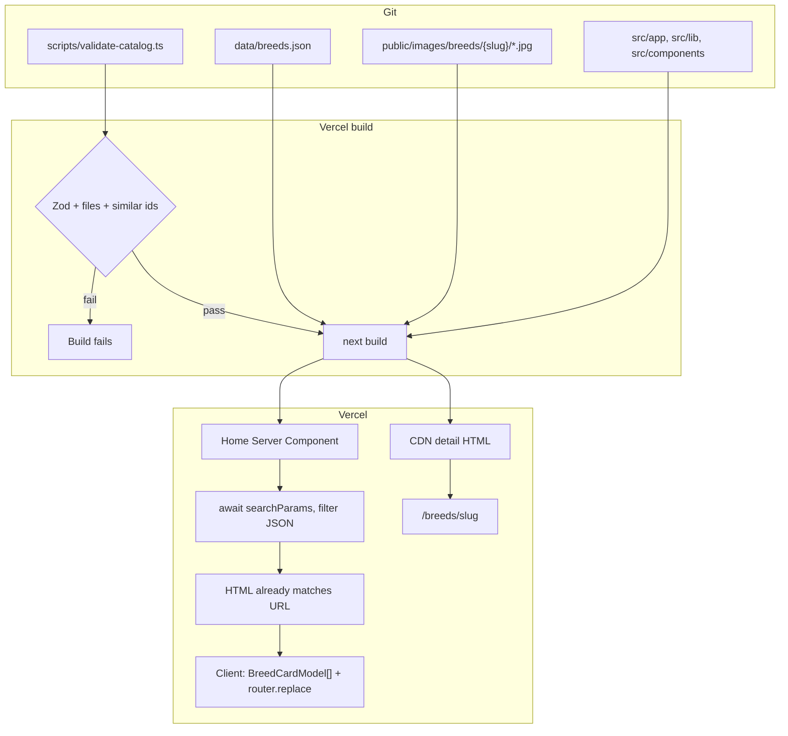
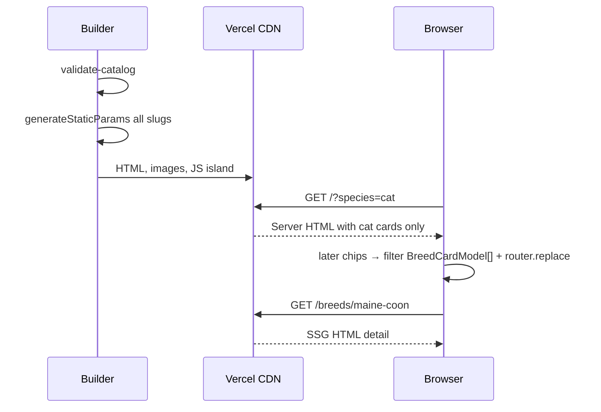

# Engineering brief — Cat & Dog Repo

| Field | Value |
|---|---|
| **Author** | Project / Design |
| **Date** | 2026-09-06 |
| **Status** | Draft |
| **Audience** | Engineering lead |

Read [PRODUCT.md](./PRODUCT.md) then this file. Schema details and editorial rules: [CONTENT-MODEL.md](./CONTENT-MODEL.md). Sequence of work: [PR-PLAN.md](./PR-PLAN.md). UX you must not contradict: [UX.md](./UX.md).

Repo root: `/home/pedro/Documents/catapp`. App is bootstrapped; catalog is not launched. Follow [PR-PLAN.md](./PR-PLAN.md).

---

## Stack and why

| Choice | Why |
|---|---|
| **Next.js (App Router) + TypeScript** | SSG, `generateStaticParams`, `generateMetadata`, `next/image`, `next/font`, first-class Vercel deploy |
| **Tailwind CSS v4** + CSS variables | Fast UI, tokens in `globals.css`, no runtime CSS-in-JS |
| **Detail SSG + home dynamic** | Details are HTML for SEO and no-JS reading. Home awaits `searchParams` so shared filter URLs match first paint |
| **Vercel** | Preview per PR, CDN, image optimization, Web Analytics, Speed Insights, instant rollback |
| **pnpm** | Lockfile, strict node_modules |
| **Zod** | Catalog validation at CI/prebuild |
| **Vitest + Testing Library + Playwright** | Unit for algorithms, a11y/component, e2e flows |
| **No DB, no auth, no CMS, no Route Handlers** | n≈50, public read-only |

**Not using** TheCatAPI / Dog API in production. **Not using** a headless CMS. **Not using** Fuse.js (aliases + substring are enough). **Not using** a UI kit.

**Pins (PR 1):** Node **20.x**, Next.js **15.5.25**, React **19.1.0**, Tailwind **v4**, pnpm **9.15.9**. Recorded in `package.json`. Bump only in a chore PR.

---

## Architecture



- No database, no auth session, no user PII. `sessionStorage["cdr:lastCatalog"]` is the only client key (All breeds link).
- `src/app/page.tsx` is a **dynamic** Server Component: await `searchParams`, `parseCatalogQuery`, `getCardModels()`, pass `initialQuery` + `cards: BreedCardModel[]` into `<Suspense><CatalogView /></Suspense>`. First render of the island **uses those props**, not `useSearchParams()` / `window.location`.
- Subsequent chip taps filter in memory and call **`router.replace(href, { scroll: false })` only**. Never `history.replaceState`.
- Detail pages are SSG Server Components, usable with JS disabled.
- There is **no** `/api/breeds`. Do not add one “for convenience.”



---

## Proposed repo file tree

```
/home/pedro/Documents/catapp/
├── docs/blueprint/                 # derived pack; canonical doc wins on conflict
├── data/breeds.json                # source of truth + photo ledger
├── public/
│   ├── favicon.ico
│   ├── icon.svg
│   ├── apple-touch-icon.png
│   └── images/
│       ├── empty-no-results.svg
│       └── breeds/{slug}/01.jpg…05.jpg
├── scripts/validate-catalog.ts
├── src/
│   ├── app/
│   │   ├── globals.css
│   │   ├── layout.tsx
│   │   ├── page.tsx
│   │   ├── not-found.tsx
│   │   ├── sitemap.ts
│   │   ├── robots.ts
│   │   ├── opengraph-image.tsx     # `/` only
│   │   └── breeds/[slug]/
│   │       └── page.tsx            # generateMetadata.images = hero JPEG
│   ├── components/
│   ├── lib/
│   │   ├── catalog.ts
│   │   ├── search.ts               # matchesQuery; not searchBreeds
│   │   ├── filters.ts
│   │   ├── similar.ts
│   │   ├── tags.ts
│   │   ├── slug.ts                 # toSlug; validator asserts id === species-slug
│   │   ├── seo.ts
│   │   └── query.ts                # CatalogQuery, parse/serialize, isSafeCatalogHref
│   └── types/breed.ts
├── tests/
│   ├── fixtures/breeds.json
│   ├── unit/*.test.ts
│   └── e2e/*.spec.ts
├── .github/workflows/ci.yml
├── next.config.ts
├── tsconfig.json
├── package.json
├── eslint.config.mjs
├── playwright.config.ts
├── vitest.config.ts
└── README.md
```

`src/components/` files: `AppHeader`, `AppFooter`, `SearchInput`, `FilterBar`, `FilterChip`, `SpeciesSegment`, `BreedGrid`, `BreedCard`, `EmptyResults`, `ClearFiltersButton`, `CatalogView`, `ResultCount`, `PhotoGallery`, `FactList`, `TraitMeter`, `TraitList`, `SimilarBreeds`, `SpeciesBadge`, `TagChip`.

---

## Breed JSON schema

Canonical types in `src/types/breed.ts`. Zod in `scripts/validate-catalog.ts` must match.

```ts
export type Species = "cat" | "dog";
export type SizeClass = "small" | "medium" | "large";
export type CoatType =
  | "short"
  | "medium"
  | "long"
  | "hairless"
  | "double"
  | "curly";
export type TraitScore = 1 | 2 | 3 | 4 | 5;

export interface BreedTraits {
  energy: TraitScore;
  shedding: TraitScore;
  trainability: TraitScore;
  goodWithKids: TraitScore;
  goodWithOtherPets: TraitScore;
  apartmentFriendly: TraitScore;
  groomingNeed: TraitScore;
}

export interface BreedPhoto {
  src: string; // "/images/breeds/{slug}/01.jpg"
  alt: string;
  width: number;
  height: number;
  credit: string;
  license: "CC0" | "CC BY" | "CC BY-SA" | "licensed" | "public-domain";
  sourceUrl: string;
  licenseUrl?: string; // required unless CC0 / public-domain; required for licensed
}

export interface CatalogRecord {
  id: string;
  slug: string;
  name: string;
  species: Species;
  sizeClass: SizeClass;
  coat: CoatType;
  aliases: string[];
  traits: Pick<
    BreedTraits,
    "energy" | "shedding" | "goodWithKids" | "apartmentFriendly"
  >;
}

export interface BreedCardModel extends CatalogRecord {
  hero: Pick<BreedPhoto, "src" | "alt" | "width" | "height">;
}

export interface LifespanRange {
  min: number;
  max: number; // >= min
}

export interface Breed {
  id: string; // MUST equal `${species}-${slug}`
  slug: string;        // "maine-coon"
  species: Species;
  name: string;
  origin: string;
  aliases: string[];
  sizeClass: SizeClass;
  coat: CoatType;
  lifespanYears: LifespanRange;
  shortDescription: string;
  description: string; // plain text, paragraphs \n\n
  traits: BreedTraits;
  photos: BreedPhoto[];          // 2–5
  similarBreedIds: string[];     // 2–4 Breed.id
}

export interface CatalogFile {
  version: 1;
  generatedAt: string; // ISO-8601 datetime, e.g. "2026-09-06T00:00:00.000Z"
  breeds: Breed[];
}
```

### Example object

Validator-valid; same bytes as the canonical doc / CONTENT-MODEL.

```json
{
  "id": "cat-maine-coon",
  "slug": "maine-coon",
  "species": "cat",
  "name": "Maine Coon",
  "origin": "United States",
  "aliases": ["Coon Cat", "Gentle Giant"],
  "sizeClass": "large",
  "coat": "long",
  "lifespanYears": { "min": 12, "max": 15 },
  "shortDescription": "A big, dog-like cat with tufted ears, a heavy ruff, and a friendly, easygoing manner — often called the gentle giant of the cat world, happiest when trailing you from room to room.",
  "description": "Maine Coons come from New England farm stock: big-boned, water-resistant, and famously social. They are the cats that greet guests at the door, follow a laptop from desk to sofa, and chirp instead of yowl when they want your attention. The look is unmistakable — lynx-tufted ears, a square muzzle, and a ruff that makes even a teenager look like a lion in winter.\n\nLiving with one means planning for hair. They shed, especially in spring, and a weekly session with a steel comb keeps the long coat from matting behind the ears and along the britches. Energy is moderate: they sprint down a hallway, then sprawl across a keyboard for an hour. They are usually patient with respectful kids and often easy with dogs, but they are still cats, not babysitters. A Maine Coon can live in an apartment if you give them height, puzzle play, and a window; they are happier when they can patrol more than one room.\n\nExpect a slow-growing cat that may not finish filling out until year four, and a lifespan commonly quoted in the low-to-mid teens. They are not a hypoallergenic breed. Individuals vary, as with every breed in this repo; the scores below describe a typical adult, not a promise about the animal on your couch.",
  "traits": {
    "energy": 3,
    "shedding": 4,
    "trainability": 4,
    "goodWithKids": 5,
    "goodWithOtherPets": 4,
    "apartmentFriendly": 3,
    "groomingNeed": 4
  },
  "photos": [
    {
      "src": "/images/breeds/maine-coon/01.jpg",
      "alt": "Maine Coon cat sitting, showing ear tufts and ruff",
      "width": 1600,
      "height": 1200,
      "credit": "Wikimedia Commons contributor",
      "license": "CC0",
      "sourceUrl": "https://commons.wikimedia.org/"
    },
    {
      "src": "/images/breeds/maine-coon/02.jpg",
      "alt": "Maine Coon walking in grass, full tail visible",
      "width": 1600,
      "height": 1200,
      "credit": "Wikimedia Commons contributor",
      "license": "CC0",
      "sourceUrl": "https://commons.wikimedia.org/"
    }
  ],
  "similarBreedIds": ["cat-norwegian-forest", "cat-ragdoll", "cat-siberian"]
}
```

Validator rules (fail the build): unique `id`/`slug`; **`id === `${species}-${slug}`**; slug kebab; aliases 0–8, not equal to name; shortDescription 140–220 chars; description 180–350 words; photos 2–5 exist on disk; first photo is `01`; each photo has `sourceUrl`; `licenseUrl` unless CC0/public-domain; `similarBreedIds` exist, same species, not self; traits 1–5 integers; count gates: PR 3 `MIN_BREEDS=8` / `MAX_BREEDS=10`; **PR 11a `MAX_BREEDS=60` (leave `MIN_BREEDS=8`)**; PR 11b `MIN_BREEDS=40` when total ≥40, keep `MAX_BREEDS=60`. Launch 40–60 with ≥15 of each species. `generatedAt` is ISO-8601 datetime.

Render `description` as text split on `\n\n`. **Never** `dangerouslySetInnerHTML`.

---

## Catalog size and search/filter

**~50 records** (40–60). Card DTO payload is small; do **not** send 180–350 word descriptions to the island.

**Locked model (K12):**

1. Server reads `searchParams`, filters, renders matching cards (or empty) — **first paint matches the URL**.
2. Client hydrates from `initialQuery` + `BreedCardModel[]` (all cards, slim).
3. Later chip taps filter in memory (instant) and `router.replace`.
4. Combinatorial filter URLs are not extra SSG pages.

Do not fetch JSON at runtime. Import it in `catalog.ts`.

**Sort:** `filterBreeds` returns `localeCompare("en", { sensitivity: "base" })` by `name`. No relevance rank.

---

## Search algorithm

`src/lib/search.ts`:

```ts
function normalize(s: string): string {
  return s
    .normalize("NFD")
    .replace(/\p{M}/gu, "")
    .toLowerCase()
    .trim()
    .replace(/\s+/g, " ");
}

export function matchesQuery(breed: CatalogRecord, q: string): boolean {
  const nq = normalize(q);
  if (!nq) return true;
  return [breed.name, ...breed.aliases].some((h) =>
    normalize(h).includes(nq),
  );
}
```

- Substring, not token-AND, not Levenshtein, not stemming.
- Empty query matches all.
- Teach aliases (“GSD”) instead of adding Fuse.js.

---

## Filter algorithm

`src/lib/filters.ts`:

`CatalogQuery` and `EnergyBand` live **once** in `src/lib/query.ts`. Also export `isSafeCatalogHref` from that file (allow `/` or `/?[A-Za-z0-9._~=&%-]+`; `new URL(value, origin).pathname === "/"`; reject `//`, `/\`, whitespace).

```ts
import type { CatalogQuery, EnergyBand } from "./query";
import type { CatalogRecord } from "@/types/breed";

export function scoreToBand(score: TraitScore): EnergyBand {
  if (score <= 2) return "low";
  if (score === 3) return "medium";
  return "high";
}

export function matchesFilters(breed: CatalogRecord, query: CatalogQuery): boolean {
  if (query.species && breed.species !== query.species) return false;
  if (query.size && breed.sizeClass !== query.size) return false;
  if (query.energy && scoreToBand(breed.traits.energy) !== query.energy)
    return false;
  if (query.shedding && scoreToBand(breed.traits.shedding) !== query.shedding)
    return false;
  if (query.kids && breed.traits.goodWithKids < 4) return false;
  if (query.apartment && breed.traits.apartmentFriendly < 4) return false;
  return true;
}

export function filterBreeds<T extends CatalogRecord>(
  breeds: T[],
  query: CatalogQuery,
): T[] {
  return breeds
    .filter((b) => matchesQuery(b, query.q ?? "") && matchesFilters(b, query))
    .sort((a, b) => a.name.localeCompare(b.name, "en", { sensitivity: "base" }));
}
```

AND across groups. Kids/apartment chips are “≥ 4”, not a band.

`CatalogQuery` is defined **once** in `src/lib/query.ts`. URL keys: `q`, `species`, `size`, `energy`, `shedding`, `kids=1`, `apartment=1`. Invalid values ignored.

URL writer: **only** `router.replace(pathname + query, { scroll: false })`. Never `history.replaceState`. Never `push` per chip.

First paint: server `searchParams` → `initialQuery` props. Do not read `window.location` or `useSearchParams()` to decide the first render (hydration mismatch). `useSearchParams` inside `<Suspense>` is optional after hydrate; props already have the query.

Also `sessionStorage.setItem("cdr:lastCatalog", href)` on each query change **only if** `isSafeCatalogHref(href)` (window-guarded). Never assign a raw stored string to `href`.

---

## Similar-breeds algorithm (deterministic)

`src/lib/similar.ts`.

**Primary (source of truth):** `breed.similarBreedIds` in editorial order. Map to breeds by `id`. Drop missing/self/other-species (CI forbids these). Return 2–4.

**Fallback** if fewer than 2 valid ids (must not ship, but code it):

- Trait vector order: `energy, shedding, trainability, goodWithKids, goodWithOtherPets, apartmentFriendly, groomingNeed`.
- Distance: Manhattan \(\sum |a_i - b_i|\).
- Candidates: same species, not self.
- Sort: distance ASC, then name ASC.
- Fill until **3** total (editorial first).

No randomness (hydration mismatch). Never mix species.

Build-time: fail if any breed has 0 valid similar ids. Warn (non-zero exit optional — **warn in stdout, do not fail**) if A lists B but B does not list A.

---

## Card tags

`src/lib/tags.ts` — `cardTags(breed): [string, string]`

1. Size label: Small / Medium / Large.
2. First match: apartment ≥ 4 → “Apartment OK”; else kids ≥ 4 → “Good with kids”; else shedding ≤ 2 → “Low shed”; else energy ≥ 4 → “High energy”; else coat label (“Long coat”, …).

---

## Routing

| Route | Rendering | File |
|---|---|---|
| `/` | Dynamic Server Component + island | `src/app/page.tsx` (`searchParams` → `initialQuery` + `BreedCardModel[]` in `<Suspense>`) |
| `/breeds/[slug]` | SSG | `src/app/breeds/[slug]/page.tsx` + `generateStaticParams`; OG via `generateMetadata` hero JPEG |
| unknown slug | 404 | `notFound()` → `src/app/not-found.tsx` |
| `/sitemap.xml` | generated | `src/app/sitemap.ts` |
| `/robots.txt` | generated | `src/app/robots.ts` |

`trailingSlash: false`. Slugs ASCII kebab, globally unique. Collision policy: suffix species (`burmese-cat`). v1 list should not collide.

`<Link>` for internal navigation. **Logo/wordmark → `href="/"`** (no query). **All breeds** → `sessionStorage["cdr:lastCatalog"]` after mount **iff** `isSafeCatalogHref` (`/` or `/?` + `[A-Za-z0-9._~=&%-]+`; `new URL(value, origin).pathname === "/"`; reject `//`, `/\`, whitespace); else `/`. SSR `href="/"`. Browser Back is native history.

---

## Image handling

**Local files, statically referenced. Not hotlinked.**

- Disk: `public/images/breeds/{slug}/{nn}.jpg` with `nn` in `01`–`05`. `01` is hero, card, OG.
- JSON `photos[].src` = `/images/breeds/{slug}/01.jpg` (public path).
- Required: `width`, `height`, `alt`, `credit`, `license`, `sourceUrl`. `licenseUrl` required unless `CC0`/`public-domain`. `licensed` requires both URLs. Catalog JSON is the rights ledger. Launch blocked on attribution completeness.
- `next/image`:
  - Cards: `sizes="(max-width: 640px) 50vw, (max-width: 1024px) 33vw, 25vw"`
  - Hero: `sizes="(max-width: 768px) 100vw, 800px"`, `priority`
  - First two home cards: `priority`
- Commit JPEG only; Vercel serves AVIF/WebP derivatives.
- Source budget: long edge ≤ 1600px, ~150–300 KB each. 50 × 3 × 250 KB ≈ 37.5 MB — no Git LFS required if compressed.
- CI: every src exists; 2–5 per breed.
- **Forbidden in production JSON:** TheCatAPI, Dog API, Unsplash, Wikimedia **runtime** URLs. Those sites are acquisition sources only; commit the files.

Gallery: CSS `scroll-snap-type: x mandatory`, no lightbox, no carousel library.

---

## SEO

- `metadataBase` from `NEXT_PUBLIC_SITE_URL` (fallback: Vercel preview URL).
- Title template `%s · Cat & Dog Repo`.
- Home title: `Find your cat or dog breed · Cat & Dog Repo`.
- Detail title: `{Name} (Cat|Dog) · Cat & Dog Repo`.
- **Home description (locked):** `Find yours among cat and dog breeds. Search by name, filter for shedding, energy, kids, and apartments, and open a photo-rich breed page.`
- Detail: `shortDescription` ≤ 160.
- Canonical per path (not per query string).
- OG: home = `src/app/opengraph-image.tsx` (1200×630 ImageResponse). Detail = `generateMetadata` `images` = hero JPEG. **No** `breeds/[slug]/opengraph-image.tsx`.
- Twitter `summary_large_image`.
- Semantic: one `h1`, `article` on detail, `<dl>` facts, list of cards.
- JSON-LD **`Thing` only** — `breedJsonLd` in `src/lib/seo.ts`.
- `sitemap.ts`: `/` priority 1.0, each breed 0.8, `monthly`.
- `robots.ts`: allow `/`. Do not `noindex` `/` because of query strings (same document).

---

## Performance budgets (mobile)

Mid-range Android, Slow 4G. Launch gates.

| Metric | Budget |
|---|---|
| LCP home and detail | ≤ 2.5 s |
| CLS | ≤ 0.05 |
| INP | ≤ 200 ms |
| Home JS gzip (route, includes Next/React) | ≤ 150 KB |
| Detail JS gzip (includes framework) | ≤ 90 KB |
| Fonts | 2 families, latin, ≤ 40 KB each |
| Filter after JS | ≤ 100 ms for 50 rows |

Tactics: SSG details, server-filtered home, `next/image` + known dimensions, `next/font`, no date library, no UI kit, pass **`BreedCardModel[]` once**, `priority` only where specified. Tailwind purged. Measure JS in PR 5/6 against 150/90 KB (framework included).

---

## Testing strategy

| Layer | Tool | Coverage |
|---|---|---|
| Integrity | `pnpm validate` on CI + `prebuild` | Zod, files, similar, counts |
| Unit | Vitest | search (alias, case, diacritics, empty), every filter key, AND combo, similar editorial + fallback, tags, query parse/serialize |
| Component | Testing Library (PR 6: FilterBar/EmptyResults; PR 7: TraitMeter) | chips `aria-pressed`, empty clear + focus, TraitMeter name |
| E2E | Playwright **in CI from PR 6** | cards render; search siamese; species=cat; combo → empty → clear + focus search; open detail; similar navigates; 404 slug; **`/?species=cat` first HTML is cats-only and no hydration error**; All breeds restores `cdr:lastCatalog` |
| A11y | Playwright + axe | `/`, one cat detail, one dog detail — no serious/critical |
| Types | `tsc --noEmit` | CI |

Unit tests use `tests/fixtures/breeds.json` (6 breeds, both species, aliases, similar graph) — **not** the full catalog.

CI (`.github/workflows/ci.yml`): lint, typecheck, validate, vitest, playwright (or playwright on main/PR against preview if browsers are heavy — default: run in CI with `playwright install --with-deps`).

---

## Deployment (Vercel)

- Git integration on `main`. Preview on every PR.
- Env: `NEXT_PUBLIC_SITE_URL` = production origin. Previews: `VERCEL_URL` fallback in `layout.tsx`.
- `package.json` engines `node: 20.x`. Pins: Next **15.5.25**, React **19.1.0**, Tailwind v4, pnpm **9.15.9**. Scripts: `dev`, `build`, `start`, `lint`, `test`, `test:e2e`, `validate`.
- Apex vs www: pick one in Vercel redirects; don’t handle in app code.
- Rollback: Vercel previous deployment. Content rollback: git revert of JSON + images.
- No middleware in v1. **Do not** set `output: "export"` (home is dynamic; we need `next/image`). Keep the default Node output.

---

## Observability

- `@vercel/analytics` — path-level page views (`/` vs `/breeds/*`).
- `@vercel/speed-insights` — LCP/INP/CLS, filter mobile.
- **v1 learning limitation:** no event taxonomy (search, empty, similar). Infer browse/share from path views + vitals until a privacy review.
- Build logs: validator prints counts + attribution completeness.
- No Sentry. No search-query logs. 404s via Vercel logs.
- Alerting: deploy failure email only.
- Footer discloses “Anonymous usage via Vercel Analytics.” No `/privacy` page.

Do not add Google Analytics / ads pixels in v1 (cookie banner, CSP, privacy).

---

## Security and privacy

Public static site. No auth, no PII, no uploads, no cookies required for core use.

| Topic | Rule |
|---|---|
| XSS | Catalog is trusted but still text-only render |
| CSP | `next.config.ts` headers: `default-src 'self'`; `img-src 'self' blob: data:`; `style-src 'self' 'unsafe-inline'`; `script-src` as Next requires; `connect-src 'self'` + Vercel insights hosts; `frame-ancestors 'none'` |
| Other headers | `referrer-policy: strict-origin-when-cross-origin`, `X-Content-Type-Options: nosniff` |
| Secrets | None except public site URL |
| GDPR | Footer: “Anonymous usage via Vercel Analytics.” **No `/privacy` page.** No cookie banner unless we add non-essential third parties |
| Slugs | `^[a-z0-9-]+$` |

Footer (required): “Not veterinary advice. Trait scores are typical for the breed, not a promise about an individual animal. Anonymous usage via Vercel Analytics.”

---

## Risks and mitigations

| Risk | Sev | Mitigation |
|---|---|---|
| Photo licensing | High | `sourceUrl` + `licenseUrl` (unless CC0/PD) in JSON; validator fails incomplete attribution; replace via PR |
| Traits treated as guarantees | Med | UX copy + footer |
| Launch with a thin catalog | Med | Validator min 40 in content PR; don’t announce before |
| Subsequent filters require JS | Low | First paint is server HTML for that URL; `<noscript>` note |
| Home JS vs framework | Med | 150 KB gzip budget includes Next/React; slim `BreedCardModel` |
| Scope creep (favorites, AI) | High | Reject for v1; see PRODUCT non-goals |
| CLS fonts/images | Med | `next/font`, width/height |
| Similar subjectivity | Low | Editorial + documented fallback |

---

## Lib surface (implement these)

```ts
// catalog.ts
getAllBreeds(): Breed[]
getBreedBySlug(slug: string): Breed | undefined
getBreedById(id: string): Breed | undefined
toCardModel(breed: Breed): BreedCardModel
getCardModels(): BreedCardModel[]

// search.ts
matchesQuery(breed: CatalogRecord, q: string): boolean

// filters.ts + query.ts (CatalogQuery lives in query.ts)
filterBreeds<T extends CatalogRecord>(records: T[], query: CatalogQuery): T[]
// returns locale-sorted by name

// similar.ts
resolveSimilar(breed: Breed, all: Breed[]): Breed[]

// tags.ts
cardTags(breed: CatalogRecord): [string, string]

// query.ts
parseCatalogQuery(params: URLSearchParams): CatalogQuery
serializeCatalogQuery(query: CatalogQuery): string
isSafeCatalogHref(value: string): boolean

// slug.ts (validator / editorial only; not imported by client)
toSlug(name: string): string

// seo.ts
breedJsonLd(breed: Breed): object
```

That is the entire domain layer. The catalog island is functions of `BreedCardModel[]` + `CatalogQuery`. Detail pages use full `Breed` on the server only.
