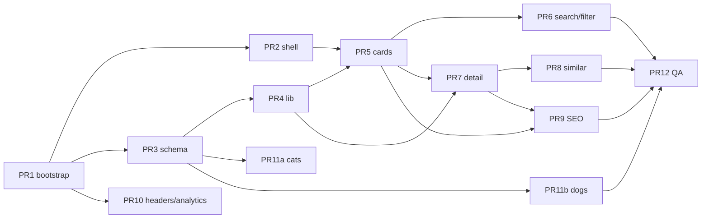

# PR plan — Cat & Dog Repo

| Field | Value |
|---|---|
| **Author** | Project / Design |
| **Date** | 2026-09-06 |
| **Status** | Draft |
| **Audience** | Engineering lead (sequence of work) |

Same plan as the canonical design document. Each PR is independently reviewable and mergeable to `main`. Preview may look incomplete; **CI must stay green** after PR 3.

Suggested merge order: **1 → 2 → 3 → 4 → 5 → 6 → 7 → 8 → 9 → 10**, with **11a/11b** starting as soon as 3 is in (parallel with UI), and **12** last.

Paths are under `/home/pedro/Documents/catapp`.

---

## PR 1 — Bootstrap Next.js app and tooling

- **Title:** `chore: bootstrap Next.js App Router, TypeScript, Tailwind, CI`
- **Files/components affected:** `package.json`, `pnpm-lock.yaml`, `next.config.ts`, `tsconfig.json`, `eslint.config.mjs`, `src/app/layout.tsx`, `src/app/page.tsx` (placeholder), `src/app/globals.css`, `.github/workflows/ci.yml`, app `README.md`, `.gitignore`, `vitest.config.ts`, `playwright.config.ts` (configs only)
- **Dependencies:** none
- **Description:** **Landed in repo.** Next **15.5.25**, React **19.1.0**, Node **20.x**, pnpm **9.15.9**, Tailwind v4. Stub home only. Do not land `data/breeds.json` here.

---

## PR 2 — Design tokens, layout shell, fonts

- **Title:** `feat: global layout, color tokens, type scale, header/footer`
- **Files/components affected:** `src/app/globals.css`, `src/app/layout.tsx`, `src/components/AppHeader.tsx`, `src/components/AppFooter.tsx`, `public/icon.svg`, `public/favicon.ico`
- **Dependencies:** PR 1
- **Description:** AA-locked palette (ink on `#FADCD6` chips, white on `#C2410C` CTA). Fraunces + Nunito, skip link, header wordmark, footer (vet + analytics). No catalog data. **Designer review:** shell.

---

## PR 3 — Breed types, Zod schema, validator, fixture JSON

- **Title:** `feat: breed catalog schema, types, and validate-catalog script`
- **Files/components affected:** `src/types/breed.ts`, `data/breeds.json` (**8–10** seed breeds), `scripts/validate-catalog.ts`, `src/lib/slug.ts`, `package.json` (`validate`, `prebuild`), `tests/fixtures/breeds.json`
- **Dependencies:** PR 1
- **Description:** Types + Zod (`id === `${species}-${slug}``, photo `sourceUrl`/`licenseUrl`, ISO-8601 `generatedAt`). **Do not land JSON without the validator.** Seed **8–10** slugs from the starter 50 (suggested: Maine Coon, Siamese, Persian, Bengal, Sphynx, Labrador Retriever, German Shepherd, French Bulldog, Pug, Beagle). `MIN_BREEDS=8`, seed-era `MAX_BREEDS=10`. No UI.

---

## PR 4 — Catalog data access, search, filter, similar, tags, query helpers

- **Title:** `feat: catalog lib — search, filters, similar breeds, URL query`
- **Files/components affected:** `src/lib/catalog.ts`, `src/lib/search.ts`, `src/lib/filters.ts`, `src/lib/similar.ts`, `src/lib/tags.ts`, `src/lib/query.ts`, unit tests
- **Dependencies:** PR 3
- **Description:** Pure functions. `CatalogQuery` in `query.ts`. `filterBreeds` / `matchesQuery` / `matchesFilters` take `CatalogRecord`. `isSafeCatalogHref` rejects `//` and non-`/` pathnames. `toCardModel`. Vitest. No React.

---

## PR 5 — Home catalog UI: cards + grid (unfiltered)

- **Title:** `feat: catalog grid and breed cards on home`
- **Files/components affected:** `src/app/page.tsx`, `src/components/BreedCard.tsx`, `src/components/BreedGrid.tsx`, `src/components/SpeciesBadge.tsx`, `src/components/TagChip.tsx`, seed images
- **Dependencies:** PR 2, PR 4
- **Description:** Server-render `BreedCardModel`s. Measure JS gzip vs 150 KB. **Designer review:** cards.

---

## PR 6 — Search, chips, URL state, empty results

- **Title:** `feat: search, filter chips, shareable query URLs, empty state`
- **Files/components affected:** `CatalogView`, `SearchInput`, `FilterBar`, `FilterChip`, `SpeciesSegment`, `EmptyResults`, `ClearFiltersButton`, `ResultCount`, `public/images/empty-no-results.svg`, e2e specs, FilterBar/EmptyResults component tests, CI Playwright job
- **Dependencies:** PR 5
- **Description:** Server reads `searchParams`; island hydrates from `initialQuery` + `BreedCardModel[]`. URL writer: `router.replace({ scroll: false })` only. Sticky contiguous bar. `cdr:lastCatalog`. Empty + Clear (focus → search). Geometric SVG OK if art is late. **Playwright in CI**, including `/?species=cat` first HTML is cats-only and no hydration error.

---

## PR 7 — Breed detail page (SSG)

- **Title:** `feat: SSG breed detail — gallery, facts, copy, trait meters`
- **Files/components affected:** `src/app/breeds/[slug]/page.tsx`, `PhotoGallery`, `FactList`, `TraitMeter`, `TraitList`, `not-found.tsx`
- **Dependencies:** PR 5, PR 4
- **Description:** `generateStaticParams`. Gallery credits per license. 404. All breeds uses `cdr:lastCatalog`. TraitMeter component test. No similar module yet.

---

## PR 8 — Similar breeds module

- **Title:** `feat: similar breeds on detail pages`
- **Files/components affected:** `src/components/SimilarBreeds.tsx`, detail page, `tests/e2e/detail.spec.ts`
- **Dependencies:** PR 7, PR 4
- **Description:** “If you like this”. Reuses `BreedCard`. E2E click similar.

---

## PR 9 — SEO, sitemap, robots, JSON-LD, Open Graph

- **Title:** `feat: metadata, sitemap, robots, JSON-LD, OG images`
- **Files/components affected:** layouts/pages, `sitemap.ts`, `robots.ts`, `src/app/opengraph-image.tsx` (**home only**), `src/lib/seo.ts`
- **Dependencies:** PR 7, PR 5
- **Description:** Locked home meta. JSON-LD `Thing`. Home OG ImageResponse 1200×630. Detail OG = hero JPEG in `generateMetadata`. **No** per-breed `opengraph-image.tsx`.

---

## PR 10 — Security headers, analytics, production env

- **Title:** `chore: CSP headers, Vercel Analytics, Speed Insights, site URL`
- **Files/components affected:** `next.config.ts`, `src/app/layout.tsx`, app `README.md`
- **Dependencies:** PR 1; ideally after PR 9
- **Description:** CSP, frame-ancestors, referrer, nosniff. Path-level analytics only. No GA.

---

## PR 11a — Catalog content: cats

- **Title:** `content: remaining cat breeds with licensed photos`
- **Files/components affected:** `data/breeds.json`, `public/images/breeds/{cat-slugs}/**`, `scripts/validate-catalog.ts` (`MAX_BREEDS` → 60)
- **Dependencies:** PR 3. Parallel with UI 4–10. Launch-blocking as a pair with 11b.
- **Description:** All **25 cats** validator-valid (copy, 2–5 photos, provenance URLs, similar ids). Keep seed dogs. **In this PR set `MAX_BREEDS=60` and leave `MIN_BREEDS=8`** (total ~30; seed-era max of 10 would fail CI). Do **not** raise `MIN_BREEDS` to 40 yet.

---

## PR 11b — Catalog content: dogs

- **Title:** `content: remaining dog breeds with licensed photos`
- **Files/components affected:** `data/breeds.json`, `public/images/breeds/{dog-slugs}/**`, `scripts/validate-catalog.ts` (`MIN_BREEDS` → 40 when total ≥40)
- **Dependencies:** PR 3; ideally after/with 11a
- **Description:** All **25 dogs** including **Pug**. Close similar graph. Flip `MIN_BREEDS` to 40. Keep `MAX_BREEDS=60` (already set in 11a). Launch-blocking.

---

## PR 12 — A11y, performance pass, launch checklist

- **Title:** `test: axe coverage, Lighthouse budgets, noscript note, launch QA`
- **Files/components affected:** `tests/e2e/*`, `CatalogView` noscript, possible trims
- **Dependencies:** PR 6, PR 8, PR 9, PR 11b
- **Description:** axe home + one cat + one dog; keyboard; reduced-motion; Lighthouse 150/90 KB JS. Playwright already in CI since PR 6.

---

## Parallelism and launch gate

**Do not publicly launch** until 11a+11b (≥40 attributed breeds) and PR 12 are on `main`.

Incomplete UI on `main` is acceptable during 1–10. Red validator is not. Seed slugs are a subset of the 50 so content PRs do not break in-flight UI URLs.

---

## Out of v1 (reject)

Login, favorites, comments, photo match / AI, user submissions, adoption/lost-and-found, CMS UI, `/api/breeds`, dark-mode toggle, i18n, lightbox, quiz, `/privacy`.
