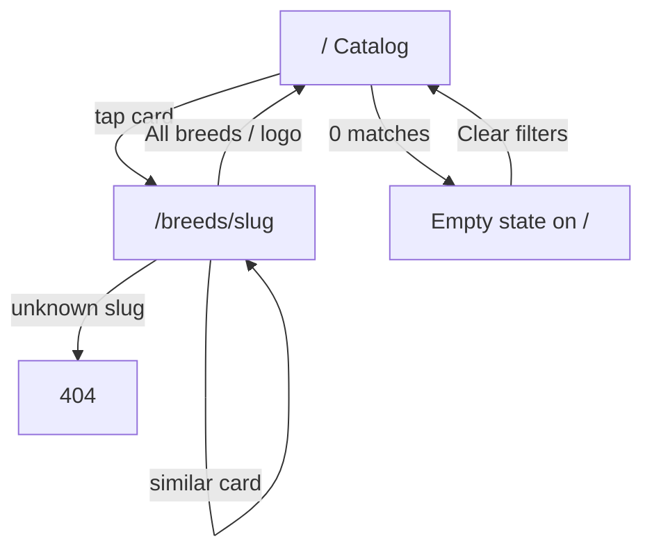
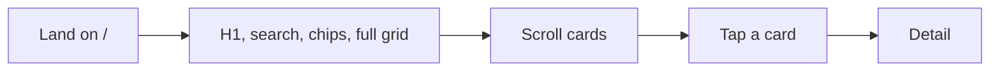
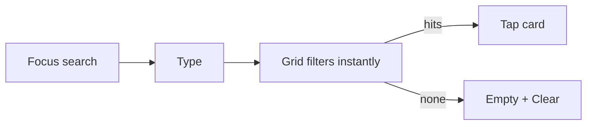
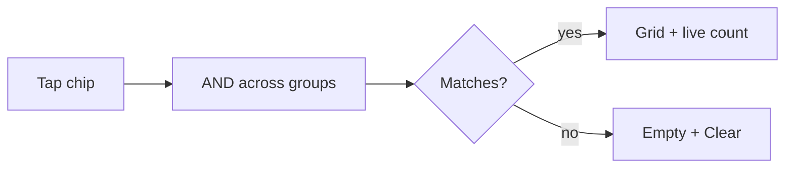
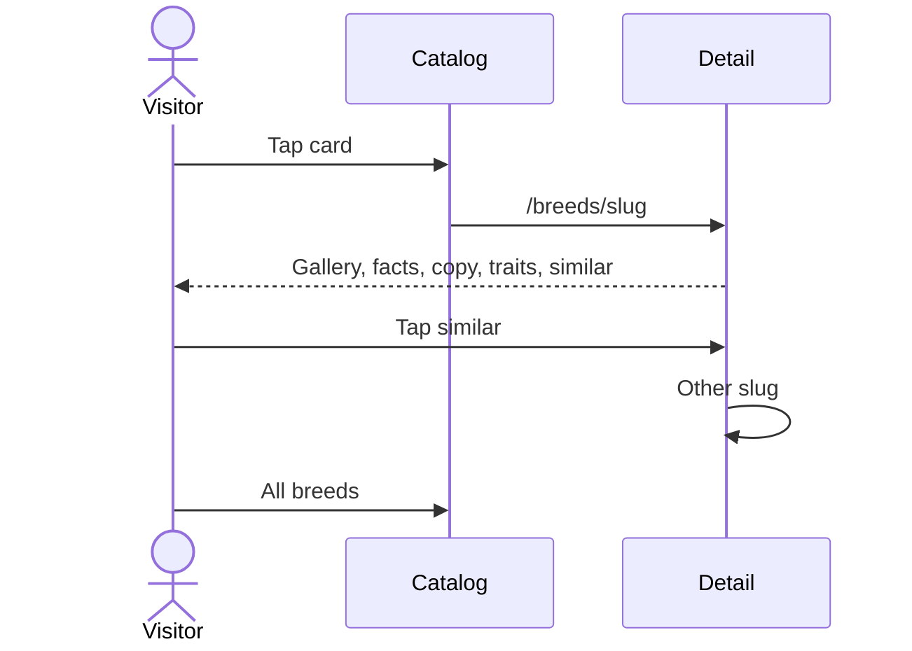
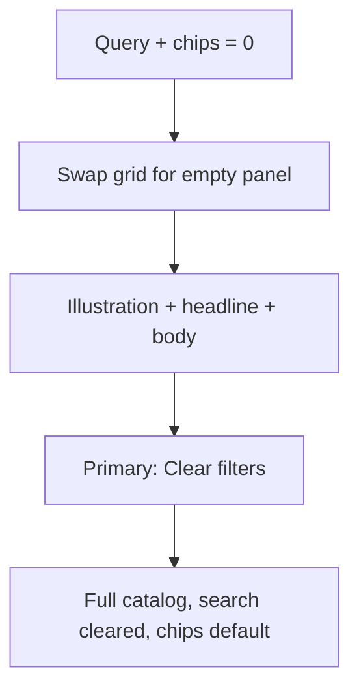

# UX / product design brief — Cat & Dog Repo

| Field | Value |
|---|---|
| **Author** | Project / Design |
| **Date** | 2026-09-06 |
| **Status** | Draft |
| **Audience** | UX / product designer |

Read [PRODUCT.md](./PRODUCT.md) first. This file is enough to design IA, screens, components, and breed copy without asking the PM. Engineering constraints that affect design (routes, image crops, perf) are called out inline; details live in [ENGINEERING.md](./ENGINEERING.md).

---

## Design principles

1. **Mobile first, actually.** Design 360×800 first. Desktop is a wider grid of the same product, not a dashboard.
2. **Playful, not childish.** Warm cream, one coral accent, a soft serif H1. No paw-print wallpaper, no Comic energy, no “so fun!!!”.
3. **Not shelter-serious.** No urgency banners, no guilt, no institutional blue-grey, no crate photography.
4. **Not Wikipedia-dry.** Big photos, short paragraphs, filters you can see without opening a drawer.
5. **Photos do the talking.** Type and chrome recede. Cards are photos with a caption, not captions with a thumbnail.
6. **Obvious filters.** The six v1 filters are on screen as chips. No hidden “more filters.”
7. **Thumb-friendly.** **44px** targets (chips included), full-width search, whole card is the hit target.
8. **Honest empty.** Zero matches is a designed moment with **Clear filters**, not a blank grid.
9. **No account gravity.** Never imply “save this” or “sign in to see more.”
10. **Motion is manners, not a feature.** 150–200ms, respect reduced motion.

---

## Information architecture and sitemap

One catalog. Species is a **filter**, not a section of the site. Do not design `/cats` and `/dogs` as separate homes.

```
Cat & Dog Repo
├── /                         Home / catalog
│                             search, chips, cards
│                             empty-results is a state of this page
├── /breeds/[slug]            Breed detail
├── 404                       Unknown path or slug
├── /sitemap.xml              Machine
└── /robots.txt               Machine
```

No About page and **no `/privacy` page** in v1. Footer has two sentences (vet + analytics). Header: wordmark (home → clean `/`) and, on detail, **All breeds** (last catalog URL) plus wordmark (clean `/`).

Deep links:

- Breed: `/breeds/maine-coon`
- Filtered catalog: `/?species=cat&apartment=1&energy=low`



---

## User flows

### Browse



Default sort: alphabetical by name. No “featured” row in v1.

### Search



Matches **name and aliases** (substring). Placeholder: “Search breeds (try GSD or Siamese)”. No submit button. Enter blurs the keyboard. No “search results page” — the grid is the results.

### Filter



Tapping an already-on size/energy/shedding chip turns it **off**. Species “All” is the default.

### Open detail and similar



### Empty results



### Shared URL

A shared detail URL is a full SSG page (SEO, OG = hero JPEG). A shared `/?species=dog&kids=1` is **server-rendered** with those chips and only matching cards in the first HTML — no full-catalog flash.

---

## Search and filter UX (locked: chips, not dropdowns)

**Why chips:** six filters, ~50 items. Every option can be visible. Dropdowns hide state and add a tap. A bottom sheet is unnecessary chrome.

### Search field

- Height 48px, type 16px (prevents iOS zoom).
- `type="search"`, `inputmode="search"`, `autocomplete="off"`.
- Visible label or `aria-label="Search breeds"`.
- Leading magnifying-glass icon, decorative.
- No trailing “Go”. A clear-X appears when `q` is non-empty.

### Species

Segmented control, mutually exclusive: **All · Cats · Dogs**. Visually heavier than optional chips so “All” reads as the zero state. Implemented as a radiogroup.

### Optional chip groups

Wrap, 8px gap, chip height **44px**, padding 14px × 10px, radius 999px. **No horizontal scroll strip** (it fights vertical scrolling). Optional chips wrap ≤ 2 rows and are **not** sticky.

| Group | Chips | Behavior |
|---|---|---|
| Size | Small, Medium, Large | Single-select; tap again to clear |
| Energy | Low, Med, High | Single-select; bands 1–2 / 3 / 4–5 |
| Shedding | Low, Med, High | Same bands |
| Lifestyle | Good with kids, Apartment OK | Toggles; on means score ≥ 4 |

Selected chip: fill `#FADCD6`, **ink** label (`#1C1917`, 13.55:1), 2px `#C2410C` border, `aria-pressed="true"`. Unselected: cream fill, sand outline, ink label. Do **not** color chips per species. Never white-on-`#E85D4C`.

### URL (designer: these are the shareable states)

`q`, `species=cat|dog`, `size=small|medium|large`, `energy=low|medium|high`, `shedding=low|medium|high`, `kids=1`, `apartment=1`. Chip taps use Next **`router.replace(href, { scroll: false })` only** (never `history.replaceState`). Back does not undo every chip. Each change also writes `sessionStorage["cdr:lastCatalog"]` only after `isSafeCatalogHref`.

### Live count

Under the H1 or beside it: “50 breeds” → “12 breeds match” → “1 breed matches”. Also `aria-live="polite"`.

### Sticky (mobile only)

**One contiguous sticky stack** (`top: 0`, cream background): **AppHeader + Search + SpeciesSegment** (~148px). H1 “Find yours” / sub and optional chips sit **below** that stack and scroll away. Do not put H1 between header and search (CSS sticky cannot reassemble a split stack).

**360×640 first paint:** sticky 148 + H1/sub ~72 + one chip row ~52 ≈ 272px chrome → ~368px for two card rows. On `md+`, nothing sticks; order is Header → H1 → Search → all chips → grid.

---

## Screen-by-screen spec

### 1. Home / catalog (`/`)

**Job:** Get to a breed in two taps, or narrow the set.

**Mobile layout (360–430px)**

| Region | Spec |
|---|---|
| **Sticky** Header 56px | Logo + wordmark. Taps **clean `/`**. |
| **Sticky** Search 48px | Full width, `id="breed-search"`. |
| **Sticky** Species 44px | All / Cats / Dogs. |
| H1 (scrolls) | **Find yours**. Sub: “A playful encyclopedia of cat and dog breeds.” When dirty, sub becomes the count (`#catalog-status`). |
| Optional chips | Size, energy, shedding, lifestyle. Wrap ≤ 2 rows. Not sticky. |
| `#breed-grid` | 2 columns, 12px gap. Empty state **keeps this id**. |
| Footer | Vet disclaimer + “Anonymous usage via Vercel Analytics.” |

**Desktop (`md+`)**

- 3 columns at 768, 4 at 1024. Never 5 — photos get stingy.
- Max width 1120px centered.
- H1 can sit left of the count. Filters in one non-sticky band.

**Cards:** see [Breed card anatomy](#breed-card-anatomy). Whole card is one link.

**Loading:** Server HTML **for that URL** (all cards on `/`, filtered on `/?…`, empty panel on zero). No skeleton, no full-catalog flash. First row of visible images eager; rest lazy. Cream placeholder.

**Error:** No runtime catalog fetch. Broken photo → cream block + alt (should not happen if CI passed).

**Noscript:** JS-disabled users see the **server HTML for that URL** (all cards on `/`, the filtered subset on `/?…`, empty panel on zero matches). Chips do not work. Locked copy: “Filters need JavaScript. Every breed matching this link is listed below.”

**Don’t**

- Pagination (50 cards is one scroll).
- “Load more.”
- Sort control.
- Map.
- Sign-in in the header.

### 2. Breed detail (`/breeds/[slug]`)

**Job:** Answer “what is living with this breed like?” and offer a next breed.

**Must include (locked):** photos, facts, descriptions, trait scores, similar breeds.

**Mobile layout, in order**

1. Header: **All breeds** (left) + wordmark (right). Wordmark → clean `/`. **All breeds** → `sessionStorage["cdr:lastCatalog"]` **only if** `isSafeCatalogHref` (`/` or `/?` + conservative charset; `new URL(value, origin).pathname === "/"`; reject `//`, `/\`, whitespace); else `/`. Server-render `href="/"`. Browser Back is native history (filtered URL preserved because chips `replace`).
2. **Gallery:** 4:3 hero, full content-column bleed. Horizontal swipe, snap, 2–5 slides. Dot indicators. **No lightbox in v1.** Caption: `CC0`/`public-domain` → `{credit}. Public domain.` (`credit` links to `sourceUrl`). `CC BY`/`CC BY-SA` → `{credit} ({license})` with name → `sourceUrl`, license → `licenseUrl`. `licensed` → `{credit}. Used under license.` with both links.
3. Species eyebrow (`CAT` / `DOG` in the species color).
4. **H1** breed name. Aliases as a muted line if any: “Also: Coon Cat, Gentle Giant”.
5. **Facts** — 2×2 on mobile, 4-across from `md`: Origin, Size, Coat, Lifespan (`12–15 years`). Use a `<dl>`.
6. **Short description** as a lead (slightly larger or medium weight).
7. **Long description** — 2–3 short paragraphs (`\n\n` in data). Plain text, not markdown.
8. Section **How they live** — intro: “Typical for the breed — individuals vary.” Then all **seven** trait meters in canonical order (see below).
9. Section **If you like this** — sub: “Close in lifestyle and looks, not a ranking.” 2–4 compact cards, horizontal snap on mobile, up to 3-up on desktop.
10. Footer.

**Loading:** SSG, hero `priority`.

**Unknown slug:** 404 screen, not an empty detail.

**Don’t:** star/favorite, comment, “compare side by side” (v2), tabs that hide traits, accordions that hide the description.

### 3. Empty / no results (state of `/`)

- Replace the card list but **keep `id="breed-grid"`** on the empty panel (skip link). Keep search + chips so the user can see what is on.
- Illustration (line-drawn cat and dog looking under a rug, or equivalent). `alt=""`. A geometric placeholder SVG is allowed if the illustration is late.
- Headline: **No pals in this mix.**
- Body: “Nothing matches those filters. Try fewer chips, or clear them and start over.”
- Primary button: **Clear filters** — white on `#C2410C` (5.18:1), 48px, full width on mobile. Clears `q` and all chips. **Then move focus to `#breed-search`.**

Never show a raw “0 results”. Never show a shelter photo.

### 4. 404 (unknown path or slug)

Different copy so it is not confused with filter-empty:

- Headline: **This breed ran off.**
- Body: “That link doesn’t match a breed in the repo.”
- CTA: **Browse all breeds** → `/`.

---

## Breed card anatomy

Single `<a href="/breeds/{slug}">`. Radius 16px, white surface, no extra button.

```
┌──────────────────────┐
│ CAT                  │  Species badge overlay, top-left
│       4:3 photo      │  object-fit cover
│                      │
├──────────────────────┤
│ Maine Coon           │  16px / 700, one line, ellipsis
│ Large · Low shed     │  exactly two tags, muted
└──────────────────────┘
```

**Two-tag rule** (deterministic; implementers use `cardTags()`):

1. Tag A = size class: Small / Medium / Large.
2. Tag B, first match:
   - `apartmentFriendly ≥ 4` → “Apartment OK”
   - else `goodWithKids ≥ 4` → “Good with kids”
   - else `shedding ≤ 2` → “Low shed”
   - else `energy ≥ 4` → “High energy”
   - else coat: “Short coat” / “Long coat” / “Hairless” / “Double coat” / “Curly coat” / “Medium coat”

Photo alt: `"{Name} {cat|dog}"` on the card (gallery photos have more specific alts).

Press: scale 0.98, 150ms, disabled when reduced motion.

---

## Trait score visualization

Canonical order on every detail page:

1. Energy  
2. Shedding  
3. Trainability  
4. Good with kids  
5. Good with other pets  
6. Apartment-friendly  
7. Grooming need  

**Meter:** label left, five **circles** 10–12px with 6px gap right. Filled = accent; empty = sand outline. Not paws at this size (they fail recognition). Not a bar. Not interactive.

Accessible name: “Energy, 4 out of 5” (visually hidden numeric). Color is not the only cue — fill vs outline.

Do not show a 1–5 number visibly unless the designer finds the dots insufficient in testing; AT always gets the number.

Meanings of 1 vs 5: [CONTENT-MODEL.md](./CONTENT-MODEL.md). Do not put the rubric on the screen; the section intro is enough.

---

## Similar / related module

**Heading:** If you like this  
**Sub:** Close in lifestyle and looks, not a ranking.

**Never say:** “Recommended for you”, “People also viewed”, “Related articles”.

**What similar means in the product:** editorially chosen **same-species** breeds a visitor might consider in the same household context (size/energy/coat vibe). It is not a recommendation engine and not “also a mammal.”

Show 2–4 cards (same `BreedCard`, compact). Same-species only. Editorial order. Engineering fallback (trait Manhattan distance) only if a record is under-linked — designers should still assume 3 cards.

Tap → that breed’s detail (full navigation, not a modal).

---

## Visual direction

### Palette (locked for PR 2)

Do not ship a pair below the measured AA ratios. Decorative coral `#E85D4C` is **logo-only**, never 16px text.

| Token | Hex | Contrast | Use |
|---|---|---|---|
| Background | `#FBF4EA` | — | Page cream |
| Surface | `#FFFFFF` | — | Cards |
| Ink | `#1C1917` | 16.01:1 on cream | Text, chip labels |
| Muted | `#57534E` | 6.99:1 on cream | Secondary 16px |
| Accent | `#C2410C` | 5.18:1 vs white; 4.74:1 on cream | CTA fill, chip border, trait dots |
| Accent hover | `#9A3412` | 7.31:1 vs white | CTA press |
| Accent soft | `#FADCD6` | 13.55:1 vs ink | Selected chip fill |
| Accent deco | `#E85D4C` | 3.44:1 vs white — not for text | Logo mark ≥48px |
| Cat | `#3D6B5A` | badge | Cat badge only |
| Dog | `#3F6F8A` | badge | Dog badge only |
| Sand | `#E8D9C4` | — | Hairlines, empty dots |
| Focus | `#1C1917` | — | 2px ring + 2px cream offset |

### Type

- **Fraunces** 600 — H1 / display. Home H1 may be slightly italic. Nowhere else italicized for decoration.
- **Nunito** 400/600/700 — UI and body.
- Body 16 / 1.5. Card title 16 / 700. Detail H1 32 mobile / 44 desktop.
- Loaded via `next/font` (engineering). Latin subset.

### Spacing and shape

8px grid. Page padding 16 / 24 / 32. Card radius 16. Chip radius 999. Max width 1120.

### Motion

Chip fill and card press 150–200ms ease-out. Gallery = native scroll-snap, not a JS carousel library. `prefers-reduced-motion: reduce` kills scale/transform; color change stays. No confetti, no bounce-in on load.

### Photography

Natural light, animal in focus, uncluttered background. 4:3 for cards and slides. No watermarks, no sad crates, no aggressive filters. Hero (`01.jpg`) should “read” at card size (face or full body, not a tiny distant animal).

---

## Component inventory

Designer should produce specs/states for:

| Component | States |
|---|---|
| AppHeader | Default, detail (with All breeds) |
| AppFooter | Default |
| SearchInput | Empty, filled, focused, with clear-X |
| SpeciesSegment | All / Cats / Dogs |
| FilterChip | Off, on, focused, pressed |
| FilterBar | Default, dirty (optional small “Clear” text button when any chip/q active — also required on empty) |
| ResultCount | N, 1, 0 (0 is empty screen, count can still say “0 breeds match”) |
| BreedGrid | 2/3/4 col |
| BreedCard | Default, press, focus |
| SpeciesBadge | Cat, dog |
| TagChip | Read-only |
| EmptyResults | Default |
| ClearFiltersButton | Default, press |
| PhotoGallery | Slide 1…n, dots, credit |
| FactList | 2×2 / 4-across |
| TraitMeter | Scores 1–5 |
| TraitList | Full seven |
| SimilarBreeds | 2–4 cards |
| 404 | Default |

No modal, no toast, no tooltip required in v1. Focus rings are enough.

---

## Accessibility

- WCAG 2.2 AA.
- Targets **≥ 44×44** (chips are **44px** tall). Meets 2.5.5; exceeds 2.5.8 (24px).
- `:focus-visible` ring on everything interactive.
- Species = radiogroup; toggle chips = `aria-pressed`.
- Result count polite live region.
- One `h1` per page. Cards are links, not inner buttons.
- Images: meaningful alt; decorative empty art `alt=""`.
- Trait dots not the only channel (hidden “n out of 5”).
- Skip link: Skip to breeds → `#breed-grid` (empty panel keeps this id).
- After Clear filters, focus `#breed-search`.
- Keyboard: tab chips and cards; Space/Enter toggles chips.
- `lang="en"`.
- Contrast as in palette. Don’t put muted grey on sand.
- Reduced motion honored.

---

## Responsive

Mobile-first breakpoints:

| Name | Width | Catalog grid | Notes |
|---|---|---|---|
| base | 0–639 | 2 | Contiguous sticky: header+search+species; H1 scrolls |
| sm | 640+ | 2 | More padding |
| md | 768+ | 3 | Filters unstuck, one band |
| lg | 1024+ | 4 | Detail may stay stacked (preferred: big photos) or split gallery/text |
| xl | 1280+ | 4, max 1120 | |

Do not design a different IA for desktop. Do not hide filters behind a “Filter” button at any breakpoint in v1.

---

## Content guidelines for breed copy

| Field | Length | Tone |
|---|---|---|
| `name` | Official common name | Title case |
| `shortDescription` | **140–220 characters** | Party one-liner. No trait laundry list. |
| `description` | **180–350 words**, 3 short paragraphs | (1) personality + hook, (2) living with them, (3) origin / notable fact. |
| aliases | 0–8 | Nicknames and abbreviations people type, not every typo |

- Affectionate, specific, concrete (“needs a daily walk”, not “somewhat active”).
- Wit at most once per breed, never mean.
- Third person on the breed page.
- Forbidden: mixed-breed shaming, aggression as destiny, “hypoallergenic guarantee”, “best first pet” unless we will stand behind it (prefer “often chosen as…”), prices, breeder links, markdown, emoji in catalog data.
- Health: one factual sentence OK.

UI microcopy (locked):

| Place | Copy |
|---|---|
| Home H1 | Find yours |
| Search placeholder | Search breeds (try GSD or Siamese) |
| Empty H | No pals in this mix. |
| Empty CTA | Clear filters |
| 404 H | This breed ran off. |
| Similar H | If you like this |
| Traits H | How they live |
| Traits intro | Typical for the breed — individuals vary. |
| Footer | Not veterinary advice. Trait scores are typical for the breed, not a promise about an individual animal. Anonymous usage via Vercel Analytics. |
| Back | All breeds |
| Home meta | Find yours among cat and dog breeds. Search by name, filter for shedding, energy, kids, and apartments, and open a photo-rich breed page. |

---

## Designer deliverables (expected)

- Mobile and desktop frames for: catalog (default, filtered, empty), detail (cat and dog examples), 404.
- Component states in the inventory table.
- Empty-state illustration (SVG). Geometric placeholder is acceptable for PR 6.
- Wordmark / simple mark (type + geometric mark). `#E85D4C` only on the mark, not on labels.
- Token confirmation against the **locked AA palette** (not the old white-on-coral pair).

Engineering will implement with Tailwind + CSS variables; pixel-perfect Figma is welcome but not a blocker for PR 1–4.
